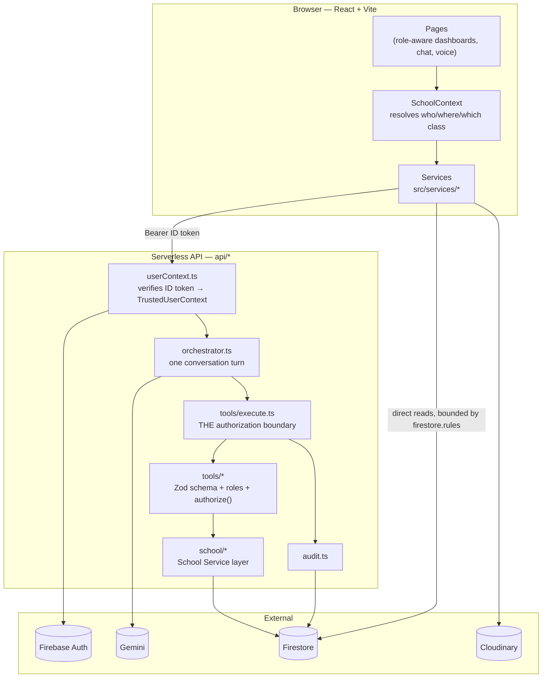
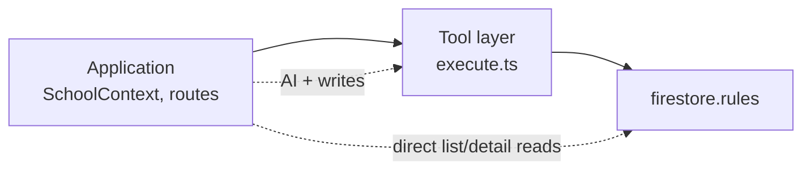
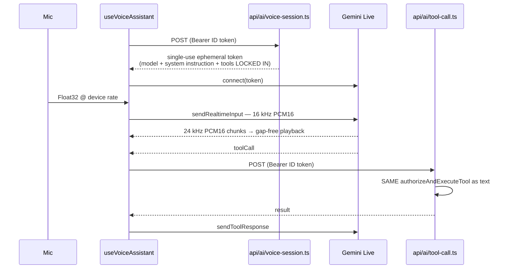

# EDVIA — Architecture

EDVIA is a human-like AI school assistant for students, parents, teachers and
school management. This document explains how it is built and, more usefully,
*why* each boundary sits where it does.

The single most important claim in this document is this:

> **The language model is never the security boundary.** It can only ever
> *ask* for a tool call. Whether that call is permitted is computed from a
> verified Firebase ID token, in code the model cannot influence. A
> completely successful jailbreak still cannot read another family's child's
> attendance.

Everything below follows from that.

---

## 1. System overview



Two paths reach Firestore, and both are constrained:

| Path | Who enforces access |
|---|---|
| Browser → Firestore (list/detail views) | `firestore.rules` |
| Browser → API → Admin SDK → Firestore (all AI traffic, all writes) | `tools/execute.ts`, then rules are bypassed by design |

There is exactly **one** production database. No localStorage store, no mock
adapter, no AI-only dataset. `scripts/seedFirestore.mjs` writes the same
collections the app reads.

---

## 2. One conversation turn

```mermaid
sequenceDiagram
    actor User
    participant API as api/ai/chat.ts
    participant Orch as orchestrator.ts
    participant Sec as security.ts
    participant Mem as memory.ts
    participant Gem as Gemini
    participant Exec as tools/execute.ts
    participant Svc as school/*
    participant FS as Firestore

    User->>API: POST /api/ai/chat (Bearer ID token)
    API->>API: resolveUserContext → role, school, links
    API->>Orch: streamConversationTurn(ctx, …)

    Orch->>Sec: screen input
    alt credential / system-prompt extraction
        Sec-->>Orch: refuse
        Orch-->>User: refusal (no model call at all)
    end

    Orch->>Orch: detectLanguage (deterministic, pre-model)
    Orch->>Mem: getOwnedMemory (ownership-checked)

    alt a confirmation is pending
        Orch->>Exec: execute confirmed action
        Exec->>Svc->>FS: write
        Orch-->>User: reports only what the tool returned
    end

    Orch->>Gem: turn + ROLE-FILTERED tool declarations
    Gem-->>Orch: functionCall(name, args)

    Orch->>Exec: authorizeAndExecuteTool
    Note over Exec: role → Zod → confirmation gate<br/>→ authorize() → handler → audit
    Exec->>Svc->>FS: read
    FS-->>Exec: records
    Exec-->>Orch: validated result

    Orch->>Gem: fenced tool result
    Gem-->>Orch: natural-language answer (streamed)
    Orch->>Mem: update subject, intent, language
    Orch-->>User: activity events + text deltas + final
```

### Why it is a generator

`streamConversationTurn` is an async generator emitting `activity`, `delta`,
`reset` and `final` events over SSE. That is what lets the avatar say
"Verifying access…" and "Checking attendance records…" at the moment those
things are *actually happening*, rather than animating a guess. An activity
label is only ever emitted immediately before the work it names.

Activity labels are deliberately coarse and user-facing. No chain-of-thought,
no tool names, no collection names.

---

## 3. Layers

### 3.1 Frontend (`src/`)

React 19 + Vite + Tailwind. Routes are lazily loaded; Recharts and the Gemini
Live SDK are separate chunks so a student checking a timetable never
downloads them.

`SchoolContext` is the answer to "who is this user, at which school, in which
class?" — resolved once from the authenticated profile. Before it existed,
screens hardcoded `cls_10a`, which meant the app worked for exactly one
seeded account and silently showed one student's class to everyone else.

### 3.2 Authentication (`api/_lib/userContext.ts`)

`resolveUserContext()` is the only place identity is established:

1. Verify the Firebase ID token (`verifyIdToken`).
2. Read `users/{uid}` from Firestore.
3. Derive `role`, `schoolId`, `studentId`, `linkedStudentIds`, `classIds`.
4. For teachers, re-derive assigned classes from the `classes` collection on
   every request, so revoking an assignment takes effect immediately.

Nothing here comes from the request body. "I am the principal" in a chat
message is ordinary text: it reaches the audit log and changes nothing else.

A profile with a missing or unrecognised role **fails closed**.

### 3.3 School Service layer (`api/_lib/school/`)

The authorized School API the challenge asks for. Tools never touch Firestore
directly; they validate, authorize, then call one of these:

| Module | Responsibility |
|---|---|
| `attendance.ts` | summaries, per-day detail, idempotent marking, class and school roll-ups |
| `people.ts` | students, classes, schools, name resolution with explicit ambiguity |
| `academics.ts` | assignments, exams, timetable, notices, resources, notifications |
| `support.ts` | teacher call requests and management escalations, with routing |
| `policy.ts` | keyword retrieval over the school handbook |

The same functions back the non-AI routes (`api/attendance/mark.ts`,
`api/support/create.ts`, `api/analytics/school.ts`). A record written by a
teacher tapping *Save Attendance* and one written by EDVIA's `markAttendance`
tool are byte-identical — that equivalence is what makes the teacher→parent
demo hold up.

### 3.4 Tool layer (`api/_lib/tools/`)

A tool is a Zod input schema, a role allow-list, an `authorize()` predicate
and a handler.

```
execute.ts, in this exact order:
  1. tool exists
  2. role allow-list                  (coarse; before validation, so a role
                                       probe can't reveal argument shapes)
  3. Zod validation                   (unknown keys stripped — a smuggled
                                       schoolId never reaches a handler)
  4. confirmation gate                (writes need a prior explicit yes)
  5. authorize()                      (ownership / school / class scope)
  6. handler
  7. audit                            (allowed AND denied, both recorded)
```

Gemini's function declarations are **derived from the Zod schemas**
(`zodToGemini.ts`). The previous version hand-maintained a parallel list with
a comment asking future authors to keep them in lockstep; they drift, and a
drifted declaration tells the model a tool accepts an argument the validator
will reject, which surfaces as an assistant that mysteriously "can't do that".

The model is only shown the declarations its role may use. A student's turn
does not contain `markAttendance` at all.

### 3.5 Authorization — three independent layers



| Actor | May access |
|---|---|
| Student | their own records only |
| Parent | linked children only |
| Teacher | students and content in assigned classes only |
| Principal | their own school only |
| Cross-school | denied, always |

`firestore.rules` is not a formality. Belonging to a school does **not** grant
access to that school's students: access requires a specific relationship
(you are the student, their parent, teach their class, or run the school).
The rules read `classIds` from the profile — written server-side only, during
invite redemption, and explicitly immutable from the client.

### 3.6 Conversation memory (`api/_lib/memory.ts`)

Two layers:

1. A bounded window of recent messages (12), for ordinary discourse.
2. A compact **structured** record — `currentStudentId`, `currentStudentName`,
   `lastIntent`, `recentEntities` — that survives beyond that window and is
   machine-readable.

The second is what makes "what about his absences?" work without re-asking:
the tool layer reads `currentStudentId` directly rather than hoping the model
restates the name.

Unbounded history is not sent to Gemini — it costs more, is slower, and is a
large untrusted surface for injected text.

**Memory can only narrow, never widen.** `conversationStudentId` is
re-intersected with the caller's real `linkedStudentIds` inside
`resolveSubjectStudent()`, so a poisoned or stale memory record cannot grant
access to anyone. This is enforced in code, not in the prompt, and is covered
by a test.

`conversationId` is client-supplied and doubles as the document id, so every
path goes through `getOwnedMemory()`, which throws `ForbiddenError` when the
record belongs to someone else. It deliberately does *not* "start fresh"
under a stranger's id — that would trade a disclosure bug for data loss.

### 3.7 Multilingual routing (`api/_lib/language.ts`)

Detection is by Unicode script, deterministically, **before** the model runs.
Three reasons it isn't left to the LLM: it's free and instant; it's reliable
for exactly the eleven required languages; and it keeps language entirely out
of the authorization path.

Hindi and Marathi share Devanagari, so the profile language breaks the tie.
Romanised input ("Rahul ki attendance kitni hai?") arrives as Latin script and
is left to the model, which is instructed to follow the user's register.

Language never changes what a caller may see — asserted by test `LANG-07`.

### 3.8 Voice (`src/hooks/useVoiceAssistant.ts`)



Audio specifics:

* **Capture** — `AudioWorklet` (audio thread, so a slow React render can't
  cause dropouts), context opened at 16 kHz so the browser's own resampler
  does the work, Float32 → Int16 → base64. `ScriptProcessorNode` fallback.
* **Playback** — a running cursor schedules each chunk to begin exactly where
  the previous one ends. Playing each chunk at "now" produces audible seams.
* **Barge-in** — on `interrupted`, every scheduled buffer is stopped and the
  cursor reset. Without this the assistant keeps talking for seconds after
  being cut off, which is the most robot-like failure a voice agent can have.

Security specifics:

* The browser never holds `GEMINI_API_KEY`. The ephemeral token is single-use,
  expires in five minutes, and has the model, system instruction and allowed
  tool list fixed inside it — a tampered client cannot reconnect with a wider
  tool set.
* Confirmation state for voice lives **server-side**, in the same
  `conversationMemory` document text chat uses. `confirmed: true` is only
  honoured when the server itself previously stored that exact tool and
  arguments as pending. If it lived in the browser, a tampered client could
  skip the confirmation step.

If anything fails, the user is told and pointed at chat. Voice is never a
prerequisite.

### 3.9 Avatar (`src/components/shared/EdviaRobot.tsx`)

States: `idle`, `listening`, `thinking`, `verifying`, `tool_execution`,
`speaking`, `success`, `error`, plus connection states for voice.

Each is driven by an event the orchestrator emits as it works. In voice mode
the mouth opens in proportion to real output amplitude and the waveform is
driven by real RMS from whichever side is audible — there is no idle
animation pretending to be activity.

### 3.10 Grounding

Every factual claim about the school must come from a tool call in the same
turn. The system instruction says so explicitly, and the tool results are the
only school facts in context.

When a tool cannot answer, the model is handed a structured instruction
rather than an empty result:

| Situation | What the model is told |
|---|---|
| ambiguous | "Ask which one. Do not guess." + the caller's own candidates |
| no data | "Tell the user honestly there is no record. Do not estimate." |
| not authorized | "Decline warmly. Do not reveal whether the record exists." |
| error | "Say you couldn't retrieve it. Do not invent a value." |

Answers backed by records carry an `AISource`, rendered as
`Source: Attendance Records` — the system of record, never a collection name.

### 3.11 Audit logging (`api/_lib/audit.ts`)

Every tool decision is recorded, allowed and denied alike. Denials matter as
much as successes: they are how "did anyone try to read data they weren't
entitled to" gets answered.

Mutations record structured before/after:

```json
{
  "userId": "uid_teacher_10a", "role": "teacher", "schoolId": "sch_greenfield",
  "action": "write:attendance", "toolName": "markAttendance", "result": "success",
  "details": { "studentId": "stu_rahul", "date": "2026-05-20",
               "oldStatus": "present", "newStatus": "absent", "changed": true },
  "timestamp": "2026-05-20T09:14:22.104Z"
}
```

Free-text message bodies are redacted to a length (`"[42 chars]"`), so a
parent's private note to a teacher never lands in an operational log. Audit
logs are server-only — not readable by the accounts they record.

### 3.12 Cloudinary

Media only, never a database. Document scans upload to
`schools/{schoolId}/users/{uid}/`, and `api/ai/document.ts` refuses a
`fileUrl` that doesn't match the caller's own prefix — so a leaked URL is not
enough. The Cloudinary API secret never reaches the client; uploads use an
unsigned, folder-restricted preset.

### 3.13 Error handling

| Dependency down | What the user sees |
|---|---|
| Gemini | "EDVIA AI is temporarily unavailable. You can continue using your school dashboard." |
| Firestore | "We couldn't retrieve the latest school data. Please try again." + retry |
| Voice | "Voice isn't available right now. You can continue with chat." + a button that does |
| A tool | "The requested action couldn't be completed." — and nothing was written |

No fallback ever invents school data. An empty period reports *no records*
rather than 0%, because "no data" and "zero" are different statements and
only one of them is true.

---

## 4. Attendance integrity

Attendance is keyed `${studentId}_${date}`, not an auto-id.

This is the highest-value correctness fix in the codebase. With auto-ids,
saving a class register twice appended a second row per student and silently
halved everyone's percentage — and because the dashboard and the assistant
read the same rows, they would agree with each other while both being wrong.

The percentage formula lives in exactly one file (`src/lib/attendanceMath.ts`),
imported by both the browser and the Node API. Present counts 1, approved
leave 0.5 (matching the seeded policy text EDVIA can retrieve), absent 0.
School roll-ups re-derive from raw record counts rather than averaging
per-class percentages, so a 6-student class can't swing the school number as
hard as a 40-student one.

---

## 5. Data model

| Collection | Key fields | Written by |
|---|---|---|
| `schools` | name, location | seed / admin |
| `users/{uid}` | role, schoolId, studentId, linkedStudentIds, teacherId, classIds, language | signup (client, restricted) + invite redemption (server) |
| `students` | fullName, rollNumber, classId, className, section, schoolId | seed / admin |
| `classes` | className, schoolId, teacherId | seed + invite redemption |
| `classSubjects` | subject, teacherName, room, schedule, classId | seed / admin |
| `attendance/{studentId}_{date}` | studentId, classId, schoolId, status, date, markedBy, markedAt, previousStatus | server only |
| `assignments`, `exams` | classId, schoolId, … | seed / admin |
| `notices`, `resources` | schoolId, … | seed / admin |
| `policies/{schoolId}/sections` | title, section, content, keywords | seed / admin |
| `notifications` | userId, read, … | server; owner may flip `read` |
| `supportRequests` | requestedBy, routedToUid, recipientType, status, schoolId | server only |
| `schoolAnalytics/{schoolId}` | counts | server |
| `conversationMemory/{id}` + `/messages` | userId, currentStudentId, pendingConfirmation, seq | server only |
| `auditLogs` | userId, role, action, result, details | server only |
| `inviteCodes/{code}` | role, schoolId, studentId/classIds, used | server only, never client-readable |

Composite indexes are declared in `firestore.indexes.json`, each annotated
with the query it serves.

**Why invite codes exist:** signup creates an account and a bare profile. It
does not know which student a new account *is*, or whose parent it belongs
to. That linkage is exactly what the AI tools trust. If a client could write
`studentId` itself, a signed-in student could point it at a classmate and
read their attendance through EDVIA. So codes are opaque, single-use, never
client-readable, and consumed inside a transaction.

---

## 6. Testing

| Suite | Command | What it proves |
|---|---|---|
| Authorization matrix, attendance integrity, security screening, orchestrator, language, 71-case AI eval | `npm test` | 191 assertions, no network. Runs the **real** `authorizeAndExecuteTool` against an in-memory Firestore double, so a pass means the shipped boundary held. |
| Firestore rules | `firebase emulators:exec --only firestore "node scripts/testRules.mjs"` | 45 assertions about what the *browser* can read directly. Needs Java. |
| Live AI eval | `npm run eval` | The same case table against a deployed instance, judging what the offline suite cannot: tool choice from natural language, entity extraction, reply language. |

The split between the offline and live eval runners is deliberate. Claiming
"50 AI tests pass" when the AI was never invoked would be dishonest; refusing
to test anything without a live key would be lazy. The authorization half —
the half that matters for safety — is verified on every run.

---

## 7. Deliberate non-goals

* **No vector database.** Policy retrieval is keyword scoring over a bounded
  handbook. If a school's policy set outgrows it, swap the internals of
  `school/policy.ts` for Gemini File Search; the tool contract doesn't change.
* **No grades model.** EDVIA does not store marks, so the principal analytics
  screen shows attendance and only shows performance/engagement tiles if the
  school actually publishes those figures. The alternative was inventing an
  "average grade: A", which the previous version did.
* **No numeric OTP.** Firebase verifies email by signed link. A six-box OTP
  screen that accepts any six digits verifies nothing; the screen now runs
  real verification and reads the real `emailVerified` flag.
* **No translated UI chips.** Replies are always in the user's language.
  Follow-up suggestion chips are English-only rather than shipping
  machine-translated strings into ten languages without a native reviewer.
