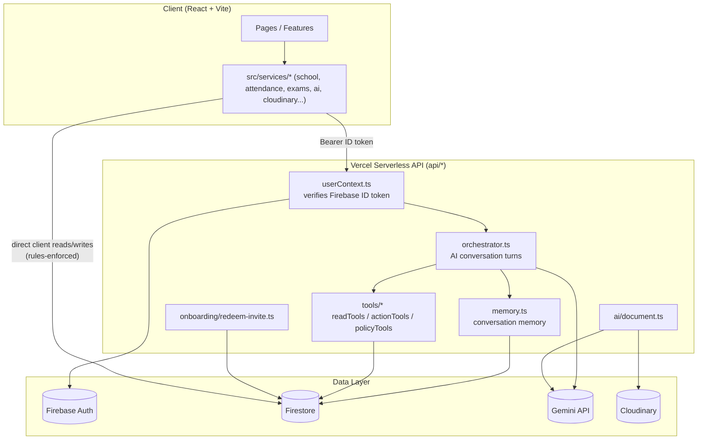
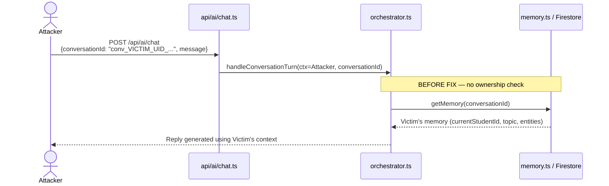
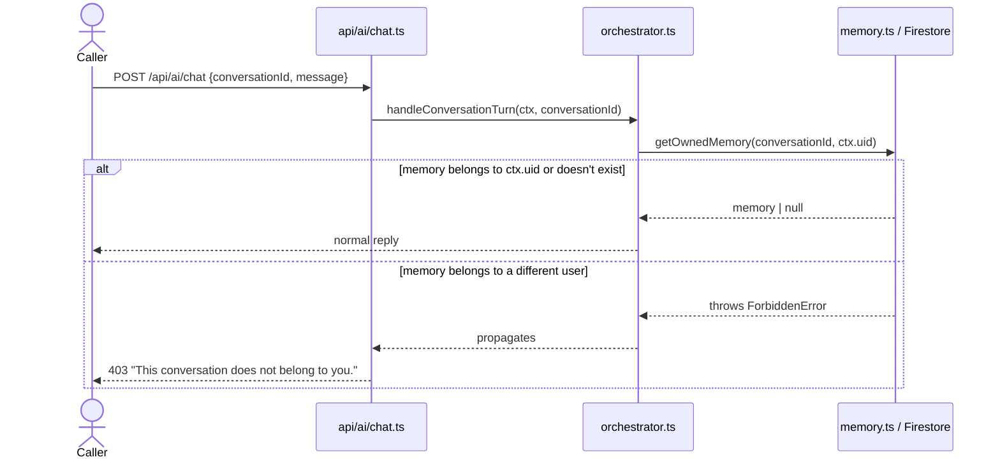
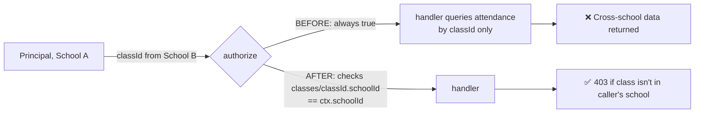
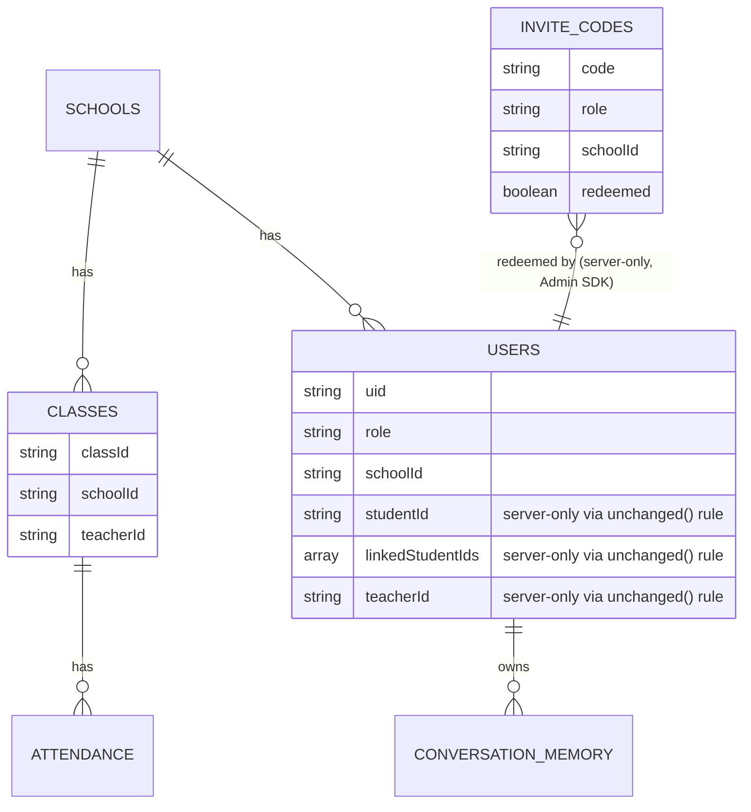

# EDVIA — Production Readiness & Security Audit Report

**Date:** August 18, 2026
**Scope:** Data-layer rewire, invite-code linkage, focused security audit, and this session's fixes.

---

## 1. Executive Summary

| Area | Status |
|---|---|
| Firebase Auth + Firestore data-layer rewire | ✅ Complete (prior session) |
| Invite-code signup→account linkage | ✅ Complete (prior session) |
| Security finding #1 — Conversation IDOR (High) | ✅ **Fixed this session** |
| Security finding #2 — Cross-school attendance leak (Medium) | ✅ **Fixed this session** |
| Security finding #3 — Cloudinary ownership (Low) | ✅ **Fixed this session** |
| Full `npm install && npm run build` with real deps | ⚠️ Not run — sandbox has no network access |
| Broader 31-point production audit (visual/perf/a11y/QA) | ⚠️ **Not re-verified this session — see §5** |

**Important honesty note on §5:** the original 31-point checklist was built and tracked in earlier chat sessions I don't have transcripts of — only the six category names survived into the continuation note. I have not fabricated a completed checklist. Section 5 states plainly what I *did* spot-check this session versus what still needs a real pass.

---

## 2. System Architecture

**Key design invariant:** the client never talks to Firestore for anything AI-related — only through the API, which authenticates the caller, authorizes the specific action, then executes. Direct client↔Firestore traffic (e.g. a teacher viewing their own roster) is instead bounded by `firestore.rules`.

---

## 3. Security Fixes — Detail

### 3.1 Finding #1 (High): Cross-user conversation hijack (IDOR)

**Before:** `conversationId` is a client-supplied string that doubles as the Firestore document key. Neither `handleConversationTurn` nor the conversation-delete route checked that the loaded memory's `userId` matched the caller.

**After:**

**Files changed:**
- `api/_lib/firebaseAdmin.ts` — added `ForbiddenError` class (403, distinct from `AuthError`'s 401).
- `api/_lib/memory.ts` — added `getOwnedMemory(conversationId, uid)`; also fixed a pre-existing type bug where `updateMemory`'s patch type omitted `pendingConfirmation` even though it's a real field written in four places.
- `api/_lib/orchestrator.ts` — uses `getOwnedMemory` instead of `getMemory`.
- `api/ai/chat.ts`, `api/ai/conversation.ts` — catch `ForbiddenError` → HTTP 403.

**Design note:** I deliberately did *not* implement "silently start fresh under the same conversationId" (the literal wording in the handoff note), because re-initializing memory under an ID that already belongs to someone else would overwrite the real owner's document — trading an information-disclosure bug for a data-integrity/DoS one. Rejecting with 403 avoids both, and legitimate traffic never hits this path since the client already scopes `conversationId` to `conv_${uid}_${timestamp}`.

### 3.2 Finding #2 (Medium): Cross-school class attendance leak

**Before:** `getClassAttendance`'s `authorize()` returned `{ allowed: true }` unconditionally for principals — no check that the requested `classId` belonged to the principal's own school.

**Fix (`api/_lib/tools/readTools.ts`):** teacher branch unchanged (already scoped via `teacherClassIds`); principal branch now looks up `classes/{classId}`, and only allows the read if that document's `schoolId` matches `ctx.schoolId`.

### 3.3 Finding #3 (Low): Cloudinary document-URL ownership

**Before:** `api/ai/document.ts` accepted any `fileUrl` under the shared Cloudinary cloud name, with no per-user/per-school scoping. Noted as low priority since default Cloudinary `public_id`s are random (not guessable), but a known/leaked URL (e.g. pasted in a notice, screenshotted) would work for anyone.

**Also found while verifying:** this endpoint and the `uploadFile` client helper aren't currently wired to any UI page — grepped `src/` for callers of `uploadFile` and `/api/ai/document` and found none. It's a live, callable API route with no current front-end entry point. Worth flagging for whoever owns that feature — either finish wiring it up or confirm it's intentionally staged for later.

**Fix:**
- `src/services/cloudinary/cloudinary.service.ts` — `uploadFile()` now accepts an optional `folder`; added `documentUploadFolder(schoolId, uid)` → `schools/{schoolId}/users/{uid}` convention for future callers.
- `api/ai/document.ts` — if a `fileUrl` contains `/schools/`, it must match the caller's own `schoolId`/`uid` prefix or the request is rejected (403). URLs without that prefix fall back to the existing cloud-name check, so nothing else breaks.

---

## 4. Data / Authorization Model (reference)

`firestore.rules` blocks direct client writes to `studentId` / `linkedStudentIds` / `teacherId` on `users/{uid}` (the `unchanged()` helper) and blocks all client reads/writes on `inviteCodes/{code}` — both are set only server-side via the Admin SDK in `redeem-invite.ts`.

---

## 5. Broader Production Audit — Honest Status

The handoff note referenced a "paused 31-point production audit" covering visual consistency, AI response quality, remaining security items, performance, accessibility, and mobile/desktop QA. **I don't have the itemized 31-point list** — it lived in earlier chat sessions that aren't available to me here, only the six category names survived into the note. I'm not going to present a checklist as "done" without having actually gone through the original items.

**What I verified for real this session** (all three security findings, by re-reading the actual current files, not trusting the summary):
- Confirmed the IDOR, cross-school leak, and Cloudinary gaps were exactly as described.
- Confirmed the invite-code system and `firestore.rules` hardening from the prior session are genuinely in place.
- Ran `tsc` across the changed files and the full `src/` tree — no real logic/signature errors introduced or pre-existing (beyond the one type bug I fixed).
- Found the unwired document-understanding feature (§3.3) as a byproduct of checking finding #3.

**What's still genuinely open:**
- Visual consistency, AI response quality, performance, accessibility, mobile/desktop QA — no pass done this session.
- A real `npm install && npm run build` — still blocked by no network access in this sandbox.

**Recommendation:** if you have the original 31-point list saved anywhere (earlier export, notes, project doc), share it and I'll work through it item-by-item with check-ins as we go, same as the original plan. Otherwise I can propose a fresh checklist for those six categories and start working through it now — your call.
