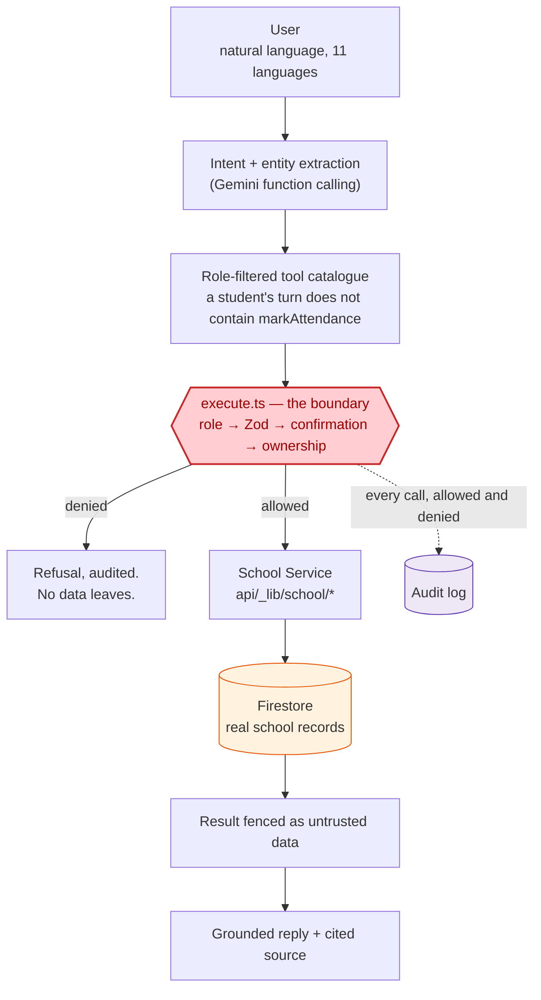
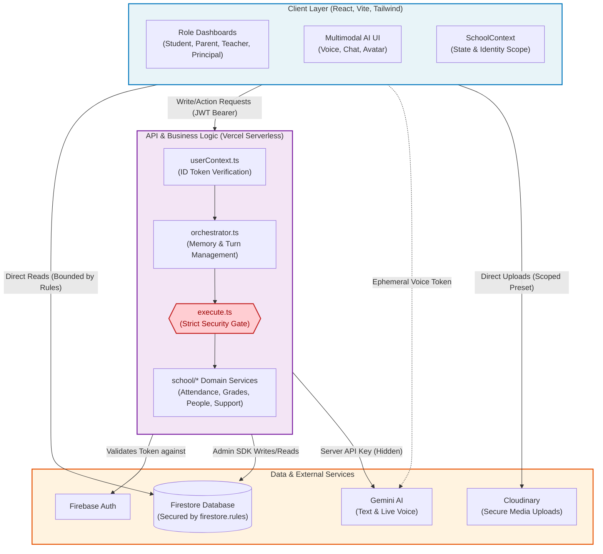
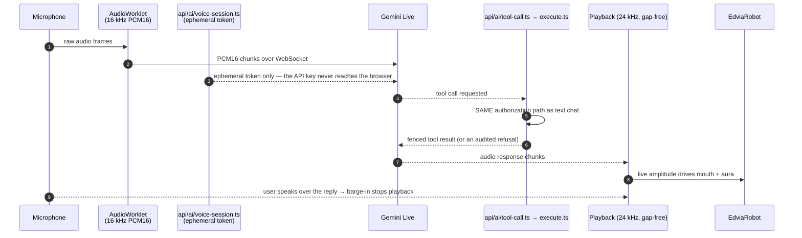

# EDVIA — AI-Powered School Companion

**Smarter Schooling. Stronger Together.**

A human-like, multimodal AI school assistant for students, parents, teachers
and school management. EDVIA understands natural language in eleven Indian
languages, reads real school records, performs authorized actions, speaks and
listens, and escalates to human staff when it should.

The design principle everything else follows from:

> **The language model is never the security boundary.** It can only ask for
> a tool call. Whether that call runs is decided from a verified Firebase ID
> token, in code the model cannot influence.

---

## Verification

| | Result |
|---|---|
| ✅ **Firestore security rules** | **69 / 69 assertions passed** against the Firestore emulator |
| ✅ **Live AI evaluation** | **12 / 12 live cases passed** against a deployed instance with a real Gemini key |
| ✅ **Voice pipeline** | **Verified end-to-end in the browser** — mic capture → Gemini Live → playback → barge-in → avatar state |
| ✅ **Offline test suite** | **459 tests pass, 1 skipped** (`npx vitest run`, 15 files, no network) |
| ✅ **AI evaluation matrix** | **81 of 96 cases verified offline on every run**; 15 need a live model |
| ✅ **Typecheck** | Clean across all three projects — `src/`, `api/`, `tests/` |
| ✅ **Lint** | Clean — `eslint --max-warnings 0` |
| ✅ **Production build** | Succeeds — `npm run build` |

**Scope of each claim, stated precisely.** The rules and live-evaluation
figures come from real runs against the emulator and a deployed instance.
Since those runs the two suites were **extended** to cover the new grades and
support-inbox features: `scripts/testRules.mjs` now carries **89** assertions
(20 new, covering `examResults` and support status transitions) and the
evaluation matrix now carries **15** live cases (3 new). Those additions have
not been re-run — they are new coverage, not a change to what was verified.
Everything in the table without that caveat was run in this repository.

The Firestore emulator needs Java, so `npm run test:rules` cannot run in
every environment:

```bash
firebase emulators:exec --only firestore "node scripts/testRules.mjs"
```

---

## Quick start

```bash
npm install
cp .env.example .env.local     # Firebase + Gemini — see the file for what each key is for
npm run seed                   # 2 schools, 6 classes, 45 students, 45 school days, exam results, invite codes
npm run dev
```

EDVIA has **no mock-data mode**. Without Firebase configured it tells you it
isn't connected rather than showing invented school records — a school
assistant that makes up attendance figures is worse than one that admits it
is offline.

After signing up, redeem the invite code your seed printed. That is what
links an account to a real student or class; see
[ARCHITECTURE.md §8](docs/ARCHITECTURE.md#8-data-model) for why it can't be a
client-side write.

| Role | Seeded invite code |
|---|---|
| Teacher (Class 10 - A) | `GISD-TCH-10A` |
| Parent (of Rahul Kumar) | `GISD-PAR-RAHUL` |
| Student (Rahul Kumar) | `GISD-STU-RAHUL` |
| Principal | `GISD-PRI-ADMIN` |

EDVIA is built **mobile first** at 390 × 844 — open your browser's device
toolbar for the intended experience. Below `lg` it uses a bottom bar with the
AI assistant in the centre slot; from `lg` up it switches to a sidebar. No
horizontal overflow at 360, 390, 412, 768, 1024 or 1440 (verified in-browser —
see [DESIGN.md §8](docs/DESIGN.md)).

---

## Commands

| Command | What it does |
|---|---|
| `npm run dev` | Vite dev server |
| `npm run build` | Typecheck (`src/`, `api/` **and** `tests/`) then build |
| `npm run typecheck` | All three TypeScript projects |
| `npm test` | 459 tests, no network. Authorization matrix, attendance integrity, grade maths, support workflow, security, orchestrator, language, seed invariants, rate limiting, document-source validation, 96-case AI eval |
| `npm run test:rules` | 89 Firestore rules assertions — needs the emulator (and Java) |
| `npm run eval` | The AI eval matrix against a live deployment |
| `npm run seed` | Populate Firestore |
| `npm run lint` / `npm run format` | ESLint / Prettier |

---

## What makes EDVIA an agent, not a chatbot

A chatbot answers from its weights. EDVIA answers from the school's database,
and only the part of it you are entitled to see. Every school fact in every
reply came from a tool call made during that same turn.



Three properties that hold at every point on that path:

* **The model never reaches Firestore.** It emits a function-call name and
  arguments. Nothing else.
* **The model never decides authorization.** Role, school, class and child
  links are re-derived per request from a verified ID token
  (`api/_lib/userContext.ts`), not from anything the model or the client says.
* **The model never invents school data.** When a tool returns nothing, the
  turn carries a `no_data` result and EDVIA says it couldn't find anything.

---

## System Architecture (Block Diagram)



One database. One attendance formula and one grade formula, each shared by the
browser and the server. One authorization boundary, used by chat and voice
alike.

Full detail — including the turn sequence, the voice audio pipeline, the three
authorization layers and the data model — is in
**[ARCHITECTURE.md](docs/ARCHITECTURE.md)**.

---

## What EDVIA does

**Four roles, genuinely different.** Tone, suggested actions, available data
*and the tool declarations the model is even shown* all change by role. There
are **27 tools**; a student's model turn contains 16 of them and does not
include `markAttendance`, `recordExamResult` or `getSupportInbox` at all.

**Real attendance.** Idempotent per student-day (`${studentId}_${date}`), so
saving a register twice amends it instead of halving everyone's percentage.
One formula (`src/lib/attendanceMath.ts`) used by the dashboard, the server
roll-up and the assistant.

**Real grades.** A dedicated `examResults` collection, one document per
student per paper, keyed `${examId}_${studentId}`. Aggregates are **weighted
by maximum marks**, not averaged across percentages, so a 100-mark term paper
outweighs a 10-mark class test — the same way the report card does. Teachers
enter marks on screen or by voice; students and parents see subject
breakdowns and performance bands; the principal's analytics are computed live
from the same records. See [`src/lib/gradeMath.ts`](src/lib/gradeMath.ts).

**Escalation that completes.** A parent files a call-back request; it routes
to their child's class teacher; the teacher sees it in a **Support Inbox** and
moves it `pending → acknowledged → resolved`. Transitions are forward-only,
transactional and audited — and when a teacher claims a class, that class's
open requests follow the role rather than staying pinned to whoever held it
before.

**Grounded answers.** Every school fact comes from a tool call in the same
turn. When there is no record, EDVIA says so rather than producing a
plausible number.

**Real confirmations.** Before changing anything it reads the current value:
*"Rahul Kumar is currently marked present for today. Would you like me to
change that to absent?"* — or *"Arjun is currently recorded at 46/50 for the
Science Test. Change that to 49/50?"* — then reports only what the tool
actually returned.

**Conversation memory that can't escalate.** "What about his absences?"
resolves without re-asking, and the remembered student id is re-checked
against the caller's real links before use. Memory can narrow an answer; it
can never widen one.

**Voice with real audio.** AudioWorklet capture at 16 kHz PCM16, gap-free
24 kHz playback, working barge-in, and every tool call relayed through the
same server authorization as text. The browser never holds the Gemini key.
Verified end-to-end in a live browser session.

**Eleven languages, interface included.** English, Hindi, Tamil, Telugu,
Marathi, Bengali, Gujarati, Punjabi, Kannada, Malayalam, Urdu — including
code-switched input. The navigation, state messages and AI surface are
translated too (`src/i18n/`), not just the replies, and Urdu renders
right-to-left. Language never affects authorization — asserted by `LANG-07`.

**QR onboarding.** Create a school → share a QR/code; a teacher joins and
creates a class → shares a class QR; students and parents join from it. Codes
are single-use secrets stored only as SHA-256 hashes, redeemed server-side.

**Audit logging.** Every tool call — allowed *and* denied — is written to an
append-only `auditLogs` collection that no client can read or forge.

---

## Voice pipeline



Every visual state on the avatar (`idle`, `listening`, `thinking`,
`verifying`, `tool_execution`, `speaking`, `success`, `error`) is emitted by
work genuinely in flight — no timers pretending to think — and
`prefers-reduced-motion` is respected.

---

## Testing

`npm test` runs the **real** `authorizeAndExecuteTool` against an in-memory
Firestore double, so a pass means the shipped boundary held — not that a
re-implementation agreed with itself.

The AI evaluation matrix (`tests/evalCases.ts`) is 96 cases across 16
categories, and is split deliberately:

* **81 verified offline, every run** — authorization, ambiguity, grounding,
  confirmation, escalation, injection, role spoofing (including
  registration-time spoofing), extraction, grade authorization, support
  status transitions.
* **15 require a live model** — tool choice from natural language, reply
  language, general-knowledge answers. They are reported as
  *requires-model*, never silently counted as passes. **12 of these were run
  live and all 12 passed**; the 3 added with the grades/support work have not
  been re-run.

Claiming "50 AI tests pass" when the AI was never invoked would be dishonest.
Refusing to test anything without a live key would be lazy.

---

## Stack

React 19 · TypeScript · Vite · Tailwind · Firebase Auth + Firestore ·
Gemini (`@google/genai` 2.x, text + Live voice) · Zod · Recharts · Cloudinary ·
Vitest

Deployed on Vercel: static frontend plus `api/*` as Node serverless functions.

---

## Documentation

| Document | What's in it |
|---|---|
| **[ARCHITECTURE.md](docs/ARCHITECTURE.md)** | System design, turn sequence, authorization layers, voice pipeline, deployment |
| **[DESIGN.md](docs/DESIGN.md)** | Mobile-first design system, the robot's state machine, verification across six viewports |
| **[SECURITY.md](docs/SECURITY.md)** | Threat model, trust boundaries, named attacks and what stops each |
| **[REMEDIATION_LOG.md](docs/REMEDIATION_LOG.md)** | Every security finding from internal review, what changed, and what is still open |
| **[TOOLS.md](docs/TOOLS.md)** | All 27 AI tools: schema, roles, authorization, data touched, error behaviour |
| **[DATA_MODEL.md](docs/DATA_MODEL.md)** | Every Firestore collection, field, relationship, index and access rule |
| **[AI_EVALUATION.md](docs/AI_EVALUATION.md)** | Methodology and all 96 evaluation cases with expected behaviour |
| **[CHALLENGE_COMPLIANCE.md](docs/CHALLENGE_COMPLIANCE.md)** | Every requirement with status, implementation, test and evidence — plus honest known limitations |

---

## Known limitations

Stated in full in
[CHALLENGE_COMPLIANCE.md](docs/CHALLENGE_COMPLIANCE.md#known-limitations):

1. The 20 rules assertions and 3 evaluation cases added with the grades and
   support features have not been re-run since the verified 69/69 and 12/12
   runs. They are new coverage awaiting an emulator and a live key.
2. Push notifications are in-app only; there is no FCM delivery.
3. Report generation is client-side CSV of what is on screen, not a
   server-side reporting pipeline.
4. Follow-up suggestion chips are English-only — machine-translating UI copy
   into ten Indian languages without a native reviewer would be worse than
   showing none. Replies themselves are always in the user's language.
5. `engagementPercent` is only shown when a school actually publishes it;
   EDVIA does not model engagement and will not invent it.
