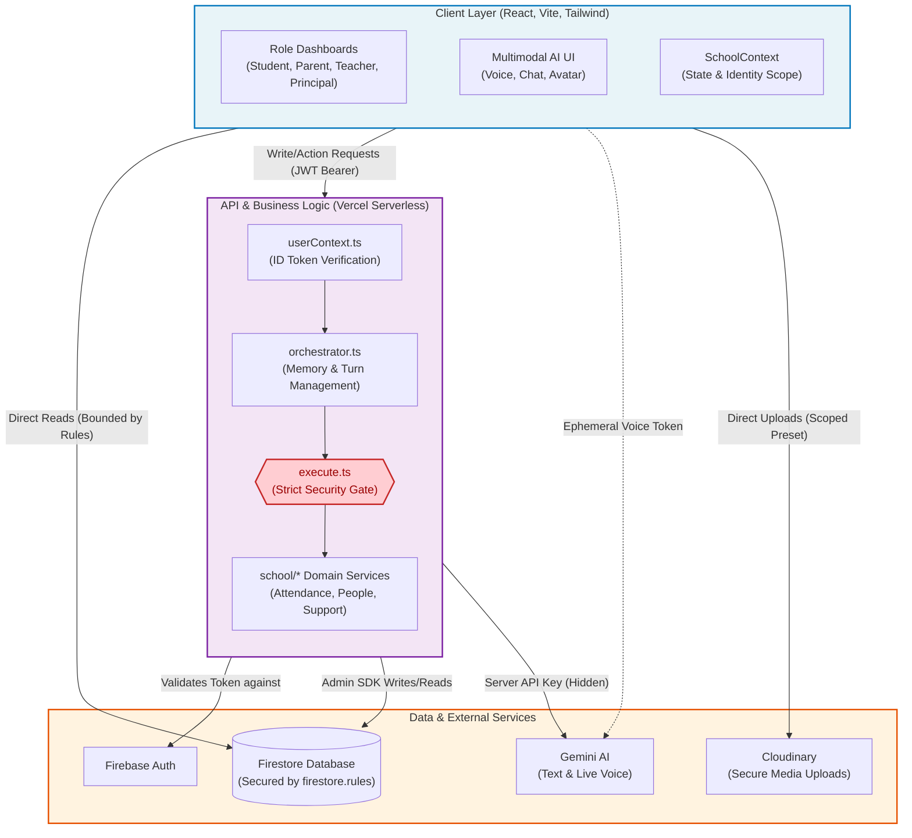
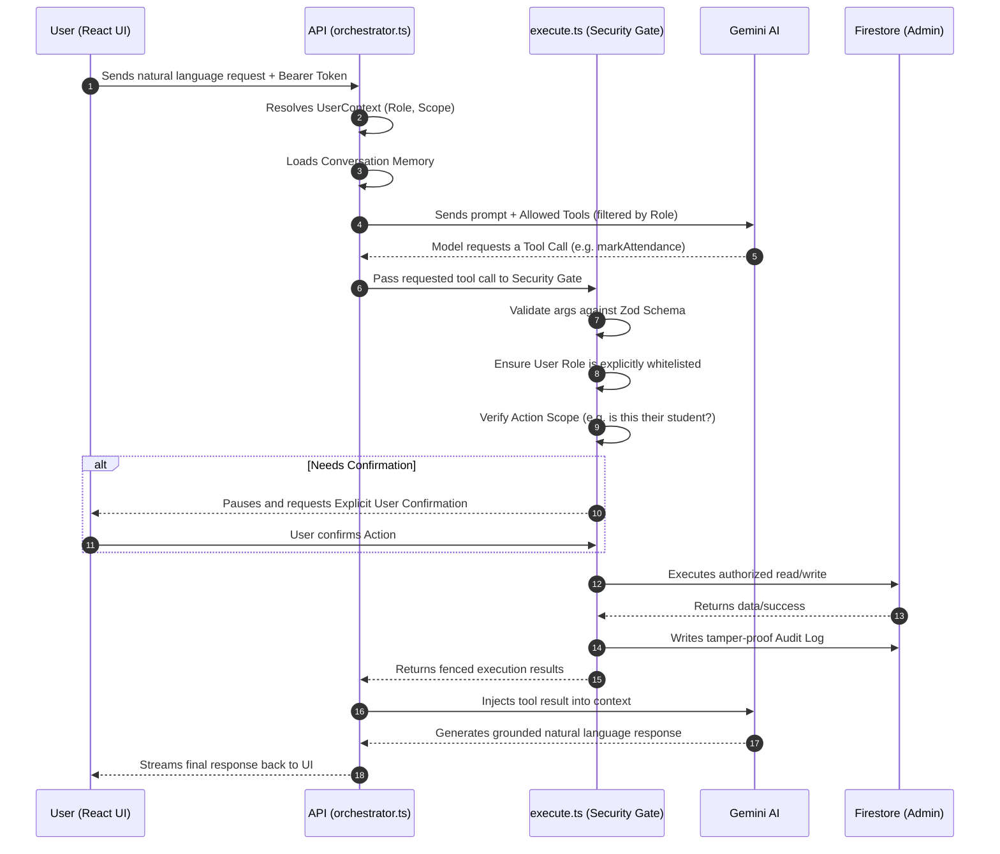

# EDVIA — AI-Powered School Companion

**Smarter Schooling. Stronger Together.**

A human-like, multimodal AI school assistant for students, parents, teachers
and school management. EDVIA understands natural language in eleven Indian
languages, reads real school records, performs authorized actions, speaks and
listens, and escalates to human staff when it should.

The design principle everything else follows from:

> **The language model is never the security boundary.** It can only ask for
> a tool call. Whether that call runs is decided from a verified Firebase ID
> token, in code the model cannot influence.

---

## Quick start

```bash
npm install
cp .env.example .env.local     # Firebase + Gemini — see the file for what each key is for
npm run seed                   # 2 schools, 6 classes, 45 students, 45 school days, invite codes
npm run dev
```

EDVIA has **no mock-data mode**. Without Firebase configured it tells you it
isn't connected rather than showing invented school records — a school
assistant that makes up attendance figures is worse than one that admits it
is offline.

After signing up, redeem the invite code your seed printed. That is what
links an account to a real student or class; see
[ARCHITECTURE.md §8](docs/ARCHITECTURE.md#8-data-model) for why it can't be a
client-side write.

| Role | Seeded invite code |
|---|---|
| Teacher (Class 10 - A) | `GISD-TCH-10A` |
| Parent (of Rahul Kumar) | `GISD-PAR-RAHUL` |
| Student (Rahul Kumar) | `GISD-STU-RAHUL` |
| Principal | `GISD-PRI-ADMIN` |

EDVIA is built **mobile first** at 390 × 844 — open your browser's device
toolbar for the intended experience. Below `lg` it uses a bottom bar with the
AI assistant in the centre slot; from `lg` up it switches to a sidebar. No
horizontal overflow at 360, 390, 412, 768, 1024 or 1440 (verified in-browser —
see [DESIGN.md §8](docs/DESIGN.md)).

---

## Commands

| Command | What it does |
|---|---|
| `npm run dev` | Vite dev server |
| `npm run build` | Typecheck (`src/`, `api/` **and** `tests/`) then build |
| `npm run typecheck` | All three TypeScript projects — `src/`, `api/`, `tests/` |
| `npm test` | 277 assertions, no network. Authorization matrix, attendance integrity, security, orchestrator, language, seed invariants, rate limiting, document-source validation, 76-case AI eval |
| `npm run test:rules` | 69 Firestore rules assertions — needs the emulator (and Java) |
| `npm run eval` | The AI eval matrix against a live deployment |
| `npm run seed` | Populate Firestore |
| `npm run lint` / `npm run format` | ESLint / Prettier |

Rules tests need the emulator running:

```bash
firebase emulators:exec --only firestore "node scripts/testRules.mjs"
```

---

## System Architecture (Block Diagram)



## AI Action Flow Diagram



One database. One attendance formula, shared by the browser and the server.
One authorization boundary, used by chat and voice alike.

Full detail — including the turn sequence, the voice audio pipeline, the
three authorization layers and the data model — is in
**[ARCHITECTURE.md](docs/ARCHITECTURE.md)**.

---

## What EDVIA does

**Four roles, genuinely different.** Tone, suggested actions, available data
*and the tool declarations the model is even shown* all change by role. A
student's model turn does not contain `markAttendance` at all.

**Grounded answers.** Every school fact comes from a tool call in the same
turn. When there is no record, EDVIA says so rather than producing a
plausible number.

**Real confirmations.** Before changing anything it reads the current value:
*"Rahul Kumar is currently marked present for today. Would you like me to
change that to absent?"* — then reports only what the tool actually returned.

**Conversation memory that can't escalate.** "What about his absences?"
resolves without re-asking, and the remembered student id is re-checked
against the caller's real links before use. Memory can narrow an answer; it
can never widen one.

**Voice with real audio.** AudioWorklet capture at 16 kHz PCM16, gap-free
24 kHz playback, working barge-in, and every tool call relayed through the
same server authorization as text. The browser never holds the Gemini key.

**Eleven languages, interface included.** English, Hindi, Tamil, Telugu,
Marathi, Bengali, Gujarati, Punjabi, Kannada, Malayalam, Urdu — including
code-switched input. The navigation, state messages and AI surface are
translated too (`src/i18n/`), not just the replies, and Urdu renders
right-to-left. Language never affects authorization — asserted by `LANG-07`.

**Escalation that doesn't overclaim.** It files a routed call request and
says *"submitted"*, never *"contacted"*.

---

## Testing

`npm test` runs the **real** `authorizeAndExecuteTool` against an in-memory
Firestore double, so a pass means the shipped boundary held — not that a
re-implementation agreed with itself.

The AI evaluation matrix (`tests/evalCases.ts`) is 76 cases across 14
categories, and is split deliberately:

* **64 verified offline, every run** — authorization, ambiguity, grounding,
  confirmation, escalation, injection, role spoofing (including
  registration-time spoofing), extraction.
* **12 require a live model** — tool choice from natural language, reply
  language, general-knowledge answers. They are reported as
  *requires-model*, never silently counted as passes.

Claiming "50 AI tests pass" when the AI was never invoked would be dishonest.
Refusing to test anything without a live key would be lazy.

---

## Stack

React 19 · TypeScript · Vite · Tailwind · Firebase Auth + Firestore ·
Gemini (`@google/genai` 2.x, text + Live voice) · Zod · Recharts · Cloudinary ·
Vitest

Deployed on Vercel: static frontend plus `api/*` as Node serverless functions.

---

## Documentation

| Document | What's in it |
|---|---|
| **[ARCHITECTURE.md](docs/ARCHITECTURE.md)** | System design, turn sequence, authorization layers, voice pipeline, deployment — with 8 Mermaid diagrams |
| **[DESIGN.md](docs/DESIGN.md)** | Mobile-first design system, the robot's state machine, verification across six viewports |
| **[SECURITY.md](docs/SECURITY.md)** | Threat model, trust boundaries, 19 named attacks and what stops each |
| **[REMEDIATION_LOG.md](docs/REMEDIATION_LOG.md)** | Every security finding from internal review, what changed, and what is still open |
| **[TOOLS.md](docs/TOOLS.md)** | All 20 AI tools: schema, roles, authorization, data touched, error behaviour |
| **[DATA_MODEL.md](docs/DATA_MODEL.md)** | Every Firestore collection, field, relationship, index and access rule |
| **[AI_EVALUATION.md](docs/AI_EVALUATION.md)** | Methodology and all 71 evaluation cases with expected behaviour |
| **[CHALLENGE_COMPLIANCE.md](docs/CHALLENGE_COMPLIANCE.md)** | Every requirement with status, implementation, test and demo step — plus honest known limitations |
| **[DEMO_SCRIPT.md](docs/DEMO_SCRIPT.md)** | A 10–12 minute walkthrough and the technical Q&A to expect |

---

## Known limitations

Summarised here, in full in
[CHALLENGE_COMPLIANCE.md](docs/CHALLENGE_COMPLIANCE.md#known-limitations):

1. Firestore rules tests are written but were not executed in the build
   environment (the emulator needs Java).
2. Voice has not been exercised end-to-end without a browser and a live key.
3. 12 evaluation cases need a live model.
4. Grades are not modelled, so analytics shows attendance rather than an
   invented average.
5. Support requests are created but never advanced past `pending` — there is
   no staff inbox yet.
