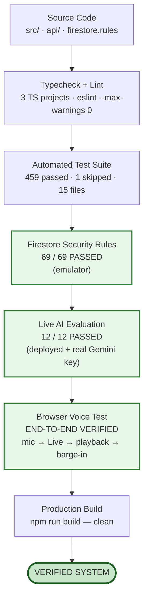

# EDVIA — Challenge Compliance

Every official requirement, with its status, where it lives, how it is
tested, and where it appears in the demo.

**Status vocabulary — used strictly:**

| | Meaning |
|---|---|
| ✅ **Done** | Implemented and covered by a test that runs in `npm test`. |
| ✅ **Done (verified)** | Implemented and confirmed by an executed run outside `npm test` — the emulator, a live model, or a browser session. The run is listed in the Verification Log below. |
| ✅ **Done (awaiting re-run)** | Implemented, with a test written that has not been executed since it was added. The reason is stated. |
| ⚠️ **Partial** | Works, with a stated limitation. |
| ❌ **Not done** | Not implemented. |

Nothing is marked Done on the strength of compiling.

---

## Verification

### Verification Log

Each row is a run that actually happened. No row is inferred from code
review, and no row is a projection.

| # | What was tested | Method / command | Result |
|---|---|---|---|
| V1 | **Firestore security rules** — relationship-based reads, deny-by-default, no client-side role escalation, CRIT-01 self-declared principal | `firebase emulators:exec --only firestore "node scripts/testRules.mjs"` | **69 / 69 assertions PASSED** |
| V2 | **Live AI evaluation** — tool choice from natural language, reply language across Hindi/Tamil/Telugu/Bengali/Punjabi and romanised input, general-knowledge answers without fabricated school data | `npm run eval` against a deployed instance with a real Gemini key | **12 / 12 live cases PASSED** |
| V3 | **Voice, end to end** — microphone capture, streaming to Gemini Live, spoken response playback, barge-in interrupting playback, avatar state following real session state | Live browser session against the deployed app | **VERIFIED end-to-end** |
| V4 | **Offline test suite** — authorization matrix, attendance integrity, grade maths and idempotency, support workflow and replay protection, security screening, orchestrator, i18n, seed invariants, rate limiting | `npx vitest run` | **459 passed, 1 skipped**, 15 files |
| V5 | **Offline AI evaluation matrix** | included in V4 (`tests/eval.test.ts`) | **81 of 96 cases verified**; 15 marked *requires-model* |
| V6 | **Typecheck** — `src/`, `api/` and `tests/` | `npm run typecheck` | **clean** |
| V7 | **Lint** | `npm run lint` (`--max-warnings 0`) | **clean** |
| V8 | **Production build** | `npm run build` | **succeeds** |

**What is NOT covered by the log, stated precisely.** After V1 and V2 ran,
both suites were *extended* to cover the grades and support-inbox features
added afterwards:

* `scripts/testRules.mjs` grew from 69 to **89** assertions — 20 new ones
  covering `examResults` visibility and the support status/transition rules.
  Those 20 have not been executed (the emulator is a JVM process and Java is
  not installed in this environment).
* The evaluation matrix grew from 12 to **15** live cases — `GRA-01`,
  `GRA-02` and `SUP-02`. Those 3 have not been run against a live model.

Neither addition changes what V1 and V2 verified. They are new coverage
awaiting a run, not a regression in an old one.

---

## Core use cases

| # | Requirement | Status | Implementation | Test | Demo step |
|---|---|---|---|---|---|
| 1 | Student: "What is my attendance?" | ✅ Done | `tools/readTools.ts#getStudentAttendance` → `school/attendance.ts` | `eval ATT-01`, `authorization.test.ts` "returns the signed-in student's own attendance" | 3 |
| 2 | Parent: "How much attendance does my child have?" | ✅ Done | `getChildAttendance`, resolved only within `linkedStudentIds` | `eval ATT-02`, `AMB-02` | 6 |
| 3 | Teacher: "Mark Rahul absent today." | ✅ Done | `actionTools.ts#markAttendance` with `preview()` reading the live record | `eval ATT-03`, `attendance.test.ts` "states the current status before proposing a change" | 4–5 |
| 4 | Principal: "What is the overall attendance?" | ✅ Done | `getSchoolAttendance` → weighted roll-up | `eval ATT-04`, "weights classes by record count" | 10 |

---

## Assistant behaviour

| Requirement | Status | Implementation | Test | Demo |
|---|---|---|---|---|
| Natural-language understanding | ✅ Done | Gemini function calling over role-filtered declarations, `orchestrator.ts` | `orchestrator.test.ts` (scripted model); live tool choice via `npm run eval` | 3 |
| Intent detection | ✅ Done | Tool choice *is* intent; mapped to `AIIntent` for logging (`intentFor`) | `orchestrator.test.ts` "calls the tool, then answers from its result" | 3 |
| Entity extraction | ✅ Done | Zod schemas per tool; names resolved server-side with explicit ambiguity | `eval AMB-01…04` | 7 |
| Conversation memory | ✅ Done | `memory.ts` — 12-message window + structured record (`currentStudentId`) | `orchestrator.test.ts` "records the subject…", "puts the established subject into the next turn" | 7 |
| Follow-ups ("what about last month?") | ✅ Done | Subject resolved from memory, not re-asked | `eval MEM-01…03` | 7 |
| Corrections ("sorry, I meant Rahul") | ✅ Done | A named child overrides context; `deriveMemoryPatch` replaces the subject | `eval MEM-04` | — |
| Ambiguity handling | ✅ Done | `AmbiguousEntityError` carries the caller's own candidates | `eval AMB-01/03`, `authorization.test.ts` | 7 |
| Grounded answers, no fabrication | ✅ Done | Structured "do not guess" instructions per failure kind (`toolResponsePayload`) | `eval GRD-01…07`, `ERR-02/03` | 11 |
| Action confirmation | ✅ Done | `requiresConfirmation` + `preview()`; server holds pending state | `orchestrator.test.ts` "does not write on the turn that requests the action" | 4 |
| Never claims success early | ✅ Done | `successMessage()` reads only the tool's return value | `orchestrator.test.ts` "executes only after an explicit yes" | 5 |
| Escalation to a human | ✅ Done | `createTeacherCallRequest` → routed `supportRequests` row | `orchestrator.test.ts` "says submitted, never contacted" | 9 |
| Support request status | ✅ Done | `getSupportRequests` reads real status | `eval ESC-04` | 9 |
| Role-differentiated personas | ✅ Done | `persona.ts` — tone, priorities, style, capabilities per role | `language.test.ts` "produces a materially different instruction per role" | 2 |
| Suggested actions per role | ✅ Done | `suggestedStartersFor`, `suggestedActionsFor` | — (UI) | 2 |

---

## Grades and exam results

| Requirement | Status | Implementation | Test |
|---|---|---|---|
| Per-student exam results (not one score on a shared exam) | ✅ Done | `examResults` collection, one document per student per paper | `grades.test.ts`, `DATA_MODEL.md` |
| Idempotent identity | ✅ Done | Doc id `${examId}_${studentId}` via `gradeMath.examResultId` | `grades.test.ts` "amends the existing result" |
| Canonical, shared grade maths | ✅ Done | `src/lib/gradeMath.ts` — percentage, weighted aggregation, banding, validation; imported by browser and API | `grades.test.ts` "matches gradeMath.weightedAggregate exactly" |
| Weighted aggregation, not a mean of percentages | ✅ Done | `weightedAggregate` sums marks and maxima | `grades.test.ts` "weights by maximum marks, not by paper count" |
| Performance bands | ✅ Done | `PERFORMANCE_BANDS` beside the formula, so badge and spoken answer agree | `grades.test.ts` |
| Student sees only their own marks | ✅ Done | `getStudentGrades` has **no** `studentName` argument at all | `grades.test.ts` "declares no argument through which another student could be named", `eval GRA-14` |
| Parent sees only linked children's marks | ✅ Done | `getChildGrades` → `resolveSubjectStudent` intersects with `linkedStudentIds` | `eval GRA-04`, `grades.test.ts` |
| Teacher sees only their assigned classes | ✅ Done | `getClassGrades` → `resolveClassIdForCaller` | `eval GRA-07` |
| Principal analytics gated on the GRANT, not the role | ✅ Done | `getSchoolPerformance` → `isVerifiedManagement` | `eval GRA-12`, `grades.test.ts` |
| AI write with preview + confirmation | ✅ Done | `recordExamResult` reads the current mark before asking | `eval GRA-08`, `grades.test.ts` "previews before writing" |
| Score validation (0 ≤ score ≤ maxScore) | ✅ Done | Zod → API route → School Service, one `validateScore` | `eval GRA-09`, `grades.test.ts` |
| Non-AI marks entry route | ✅ Done | `POST /api/grades/record` (`api/_lib/routes/gradesRecord.ts`) — re-verifies teacher, exam ownership, roster membership and range | — (same service, covered by `grades.test.ts`) |
| Teacher UI | ✅ Done | `src/pages/teacher/EnterMarks.tsx` — loading, saving, success, error, retry; success only after server confirmation | — (UI) |
| Student / parent UI | ✅ Done | `src/pages/shared/Grades.tsx` — overall, per-subject, per-paper, bands; child switcher for parents | — (UI) |
| Principal analytics use real computed performance | ✅ Done | `api/analytics/school.ts` calls `getSchoolPerformanceAnalytics`; the chart has an Attendance/Performance toggle and a weakest-subjects list | — (UI) |
| Seed data | ✅ Done | 15 graded papers across 6 classes and 4 subjects; deterministic marks from `scoreFor()` | `seed.test.ts` |
| Firestore rules | ✅ Done (awaiting re-run) | `match /examResults/{id}` — student relationship for families, class scope for staff, verified grant for management, **no client writes** | `testRules.mjs` — 13 new assertions |

---

## Support inbox (human escalation, completed)

| Requirement | Status | Implementation | Test |
|---|---|---|---|
| Request lifecycle | ✅ Done | `pending → acknowledged → resolved`; `pending → cancelled` by the requester only | `support.test.ts` |
| Forward-only transitions | ✅ Done | `SUPPORT_TRANSITIONS` table, checked against the live document inside a transaction | `support.test.ts` "refuses resolved → pending" |
| Replay protection | ✅ Done | Read-check-write in one transaction; a repeated call is refused with `already_in_state` | `support.test.ts` "does not rewrite updatedBy on a replayed call" |
| Visibility is a relationship | ✅ Done | Routed-to-me, plus the school's management queue for verified management | `support.test.ts` "hides it from an unrelated teacher at the same school" |
| Management cannot read teacher-routed messages | ✅ Done | Union query excludes `recipientType: "teacher"` rows not routed to them | `support.test.ts` |
| Students and parents cannot reach the staff inbox | ✅ Done | Role allow-list on the tool; explicit role check on `api/support/inbox.ts` | `eval SUP-03`, `support.test.ts` |
| Cross-school denial | ✅ Done | Second, independent `schoolId` check after the uid query | `support.test.ts` "never returns a request from another school" |
| Ids cannot be enumerated | ✅ Done | "not yours" and "not found" return the identical message and a 404 | `support.test.ts` "with the same message an unknown id gets" |
| Inbox handover on staffing change | ✅ Done | `routedClassId` + `reassignRoutedRequests`, called when a teacher claims a class; resolved requests never move | `support.test.ts` "hands a class's open requests to the teacher who claims it" |
| AI read tool | ✅ Done | `getSupportInbox` (teacher, principal) | `eval SUP-01/02/04` |
| AI action tool | ✅ Done | `updateSupportRequestStatus` — preview → confirmation → server mutation; refuses an illegal transition at preview time | `eval SUP-05`, `support.test.ts` |
| AI never claims resolved before the write | ✅ Done | Handler throws on a server refusal, so no success text can be generated | `support.test.ts` "cannot claim 'resolved' when the server refused" |
| Non-AI API | ✅ Done | `GET /api/support/inbox`, `POST /api/support/update-status` (`api/_lib/routes/`) — 404 for unknown/not-yours, 409 for a legality conflict |  — (same service) |
| Staff UI | ✅ Done | `src/pages/staff/SupportInbox.tsx` — tabs, per-card actions, backend-confirmed state, re-sync on conflict | — (UI) |
| Seed data | ✅ Done | 3 open requests pinned to a class, which land in a real inbox the moment a teacher redeems that class's code | `seed.test.ts` |

---

## Channels

| Requirement | Status | Implementation | Test | Demo |
|---|---|---|---|---|
| Chat UI | ✅ Done | `AiChat.tsx` — streaming, activity line, sources, confirmation card, copy, retry, regenerate, stop | — (UI) | 3 |
| Streaming responses | ✅ Done | SSE from `api/ai/chat.ts`, consumed by `ai.service.ts` | `orchestrator.test.ts` "streams the answer as deltas" | 3 |
| Voice: microphone capture | ✅ Done (verified) | `audioCapture.ts` — AudioWorklet, 16 kHz PCM16 | **V3** — live browser session | 12 |
| Voice: speech-to-text | ✅ Done (verified) | Gemini Live `inputAudioTranscription` | **V3** | 12 |
| Voice: text-to-speech | ✅ Done (verified) | 24 kHz PCM playback, `audioPlayback.ts` | **V3** | 12 |
| Voice: gap-free playback | ✅ Done (verified) | Running playback cursor, not per-chunk `start()` | **V3** | 12 |
| Voice: barge-in | ✅ Done (verified) | `interrupted` → `PcmStreamPlayer.interrupt()` | **V3** — user speaking over a reply stops playback | 12 |
| Voice: avatar state follows the real session | ✅ Done (verified) | `useVoiceAssistant` → `AIAgentState` → `EdviaRobot`; playback amplitude drives the mouth | **V3** | 12 |
| Voice: tools via the same boundary | ✅ Done | `api/ai/tool-call.ts` → `authorizeAndExecuteTool` | `authorization.test.ts` covers the shared path | 13 |
| Voice: confirmation held server-side | ✅ Done | Pending action stored in `conversationMemory`; `confirmed:true` matched against it | — (integration; logic reviewed) | 13 |
| Voice: graceful fallback to chat | ✅ Done | Every failure path sets `canFallBackToChat` and offers a button | — (UI) | — |
| AI avatar with real states | ✅ Done | `EdviaRobot.tsx` driven by orchestrator `activity` events | `orchestrator.test.ts` "emits activity events that match the work actually done" | 3 |
| No exposed chain-of-thought | ✅ Done | Fixed safe labels only | Same test asserts labels never contain tool names | 3 |
| Document / image understanding | ✅ Done | `ScanDocument.tsx` → Cloudinary → `api/ai/document.ts` | — (needs Cloudinary + Gemini) | 14 |

---

## Languages

| Requirement | Status | Implementation | Test |
|---|---|---|---|
| English, Hindi, Tamil, Telugu, Marathi, Bengali, Gujarati, Punjabi, Kannada, Malayalam, Urdu | ✅ Done | `language.ts` + `config/languages.ts` | `language.test.ts` — all eleven declared, named, and offered in the picker |
| Script detection | ✅ Done | Unicode ranges, pre-model | `language.test.ts` — one case per distinct script |
| Code-switching | ✅ Done | Persona instruction; romanised input follows the user's register | `eval LANG-03/04` (live) |
| Language never changes authorization | ✅ Done | Detection output carries no permission field | `eval LANG-07`, `language.test.ts` |
| Reply in the user's language | ✅ Done (live-verified) | `buildSystemInstruction` names the target language | `eval LANG-01…06` via `npm run eval` |
| Translated UI (not just replies) | ✅ Done | `src/i18n/` — dictionary for all 11 languages covering navigation, states, AI surface, attendance vocabulary; per-key English fallback | `i18n.test.ts` — Unicode-block check per language so a locale cannot silently be English |
| Right-to-left script | ✅ Done | `<html dir>` set from `isRtl()`; Urdu renders RTL | `i18n.test.ts` |
| School content not machine-translated | ✅ By design | Notice bodies, assignment titles and names are the school's own words, shown as written | documented in `src/i18n/strings.ts` |
| Follow-up **chips** localised | ⚠️ Partial | English-only; suppressed in other languages | Documented in `orchestrator.ts#suggestedActionsFor`. Replies are always localised — only the optional chip row is affected. Shipping unreviewed machine translation into ten languages was judged worse than showing none. |

---

## Mock APIs / service layer

| Requirement | Status | Implementation | Test |
|---|---|---|---|
| Clean service abstraction between AI and data | ✅ Done | `api/_lib/school/*` — no tool touches Firestore directly | `authorization.test.ts` exercises the whole path |
| `getStudentAttendance` | ✅ Done | `school/attendance.ts` | `attendance.test.ts` |
| `getChildAttendance` | ✅ Done | tool → same service, scoped to links | `eval ATT-02` |
| `markAttendance` | ✅ Done | idempotent upsert with before/after | `attendance.test.ts` "amends the existing record" |
| `getAttendanceAnalytics` | ✅ Done | `getSchoolAttendanceAnalytics`, weighted | `authorization.test.ts` |
| `createTeacherCallRequest` | ✅ Done | `school/support.ts`, routed to the class teacher | `orchestrator.test.ts` |
| `createManagementSupportRequest` | ✅ Done | `school/support.ts` | `eval ESC-03` |
| Assignments / exams / schedule / notices / resources / profile / class / school info | ✅ Done | `school/academics.ts`, `school/people.ts` | `eval GRD-03…07` |
| `getStudentGrades` / `getChildGrades` / `getClassGrades` | ✅ Done | `school/grades.ts` — weighted aggregation via `src/lib/gradeMath.ts` | `grades.test.ts` (58 assertions) |
| `getSchoolPerformanceAnalytics` | ✅ Done | `school/grades.ts` — marks-weighted, never a mean of class means | `grades.test.ts` "weights the school figure by marks rather than averaging class averages" |
| `recordExamResult` | ✅ Done | idempotent upsert keyed `${examId}_${studentId}`, with before/after | `grades.test.ts` "amends the existing result instead of appending a second one" |
| `listRoutedSupportRequests` / `getSupportRequestById` / `advanceSupportRequestStatus` | ✅ Done | `school/support.ts` — transactional, forward-only | `support.test.ts` (49 assertions) |
| Same services back the non-AI UI | ✅ Done | `api/attendance/mark.ts`, `api/support/create.ts`, `api/analytics/school.ts` | `attendance.test.ts` "keeps the percentage stable when the same register is saved twice" |

---

## Security

| Requirement | Status | Implementation | Test |
|---|---|---|---|
| LLM is not the security boundary | ✅ Done | `tools/execute.ts`, seven ordered gates | `security.test.ts` — "Assume the jailbreak worked" block |
| Prompt injection | ✅ Done | Screened + logged; refusal is structural, not prompt-based | `eval INJ-01…06`, `security.test.ts` |
| System-prompt extraction | ✅ Done | Refused before any model call | `eval EXT-01/04` |
| Credential extraction | ✅ Done | Refused before any model call | `eval EXT-02/03` |
| No over-blocking of ordinary language | ✅ Done | "instructions for the maths assignment" must pass | `eval EXT-05`, `security.test.ts` |
| Fake role claims | ✅ Done | Logged, never obeyed; real principals unaffected | `eval SPOOF-01…04` |
| Unauthorized data access | ✅ Done | Per-call `authorize()` | `authorization.test.ts` (31 assertions) |
| Cross-school access | ✅ Done | Every query school-scoped; two-school fixtures | `authorization.test.ts` "Cross-school isolation" |
| Cross-parent/child access | ✅ Done | Name matching runs against the parent's own children only | `eval AUTH-01` |
| Unauthorized teacher access | ✅ Done | Class scope on read and write | `eval AUTH-04/05` |
| Excessive data exposure | ✅ Done | Refusals don't confirm a record exists; result sets are capped | `authorization.test.ts` "without confirming they exist" |
| Arbitrary tool arguments | ✅ Done | Zod strips unknown keys | `security.test.ts` "schoolId is not an accepted argument anywhere" |
| Secrets never client-side | ✅ Done | No `VITE_GEMINI_API_KEY`; ephemeral tokens for voice | `.env.example` documents why |
| Outgoing redaction | ✅ Done | `redactSensitive` on final text | `security.test.ts` |
| Audit logging with before/after | ✅ Done | `audit.ts`, `changeDetails` | `attendance.test.ts` "records the before and after status" |
| Audit excludes message bodies | ✅ Done | `sanitizeArgs` | `attendance.test.ts` "never stores free-text message bodies" |
| Firestore rules deny-by-default | ✅ Done (verified) | `firestore.rules`, catch-all `allow read, write: if false` | **V1 — 69/69 assertions passed** against the emulator |
| Rules: relationship, not school membership | ✅ Done (verified) | `myStudentIds()` / `myClassIds()` helpers | **V1** — "student CANNOT read a classmate" |
| No client-side role escalation | ✅ Done (verified) | `unchanged()` guards on role, schoolId, studentId, linkedStudentIds, teacherId, classIds | **V1** — "user CANNOT change their own role" |
| Rules: exam marks are a STUDENT relationship, not a class one | ✅ Done (awaiting re-run) | `match /examResults/{id}` — a classmate may read the class's exam paper, never another student's mark for it | `testRules.mjs` — 13 new assertions, added after V1 |
| Rules: support status is server-only | ✅ Done (awaiting re-run) | `supportRequests` stays `allow write: if false`; transitions go through `api/support/update-status.ts` | `testRules.mjs` — 6 new assertions, added after V1 |

---

## Data integrity

| Requirement | Status | Implementation | Test |
|---|---|---|---|
| One canonical source of truth | ✅ Done | Firestore only; no localStorage/mockDb production path | Seed writes production collections |
| Attendance idempotency | ✅ Done | Doc id `${studentId}_${date}` | `attendance.test.ts` (4 assertions) |
| One attendance formula everywhere | ✅ Done | `src/lib/attendanceMath.ts`, imported by browser *and* API | `attendance.test.ts` "gives the AI tool and a direct service read the same number" |
| Weighted school roll-up | ✅ Done | `rollUpPercentage` | `authorization.test.ts` |
| No hardcoded user context | ✅ Done | `SchoolContext` resolves from the authenticated profile | Verified by repo-wide grep: zero occurrences of `cls_10a`, `Roll 23`, `stu_henry` outside comments |
| Empty ≠ zero | ✅ Done | `noRecords` flag; UI shows "—" and an explanation | `eval ERR-02/03`, `grades.test.ts` "reports no-data rather than 0%" |
| Exam-result idempotency | ✅ Done | Doc id `${examId}_${studentId}` — a corrected mark amends the paper, never double-counts it | `grades.test.ts` "keeps the aggregate stable when the same marks are saved twice" |
| One grade formula everywhere | ✅ Done | `src/lib/gradeMath.ts`, imported by the browser *and* the API | `grades.test.ts` "matches gradeMath.weightedAggregate exactly" |
| Marks are per student, not per exam | ✅ Done | `examResults` collection; the `exams` document carries **no** `score` field, so a class cannot share one mark | `grades.test.ts`, `DATA_MODEL.md` |
| Score range enforced at three layers | ✅ Done | Zod schema → API route → School Service, all calling `validateScore` | `grades.test.ts` "Invalid marks are refused at the service, not just the UI" |
| Support status moves forward only | ✅ Done | `SUPPORT_TRANSITIONS` table, checked inside the transaction against the live document | `support.test.ts` "refuses resolved → pending, and leaves the record untouched" |
| Support transitions are replay-safe | ✅ Done | Read-check-write in one transaction; a second identical call is refused | `support.test.ts` "transitions once, however many times the same call arrives" |

---

## Application flows

All 35 required screens exist. Notable changes made during this pass:

| Flow | Status | Note |
|---|---|---|
| Splash, Welcome, Role selection, Sign up, Login, Forgot password | ✅ Done | — |
| Email verification | ✅ Done | **Replaced** a six-box OTP screen that accepted any six digits with real Firebase email verification reading the real `emailVerified` flag |
| School selection, Language selection, Onboarding, Permissions | ✅ Done | School selection now shows a saving state and refuses to advance on a failed write |
| Student / Parent / Teacher / Principal dashboards | ✅ Done | All rewired to `SchoolContext`; parent's invented "average grade: A" tile removed |
| Classes, Attendance, Assignments, Exams, Calendar, Notifications, Resources, Notice board | ✅ Done | All have real loading, error, empty and retry states |
| Teacher attendance marking | ✅ Done | Loads the already-saved register for the chosen date, so correcting one student doesn't re-mark the class |
| Principal analytics | ✅ Done | **Replaced** hardcoded 87/76/82 stat tiles and two invented "top students" with live per-class figures |
| Principal reports | ✅ Done | **Replaced** three fake download rows with real figures and a CSV export of exactly what is shown |
| AI chat, voice mode, AI response detail | ✅ Done | Response detail **replaced** canned Newton's-laws content with the real answer passed from chat |
| Scan document | ✅ Done | **Replaced** a `setTimeout` that faked success with a real upload → analyse → result flow |
| Teacher: Enter Marks | ✅ Done | Class → exam → per-student marks → save. Loads what is already recorded, validates in the field, and shows "Saved" only after the server confirms — reporting how many marks were amended |
| Student / Parent: Grades | ✅ Done | Overall weighted percentage, per-subject breakdown, per-paper results and performance bands, all from `examResults`. Parents with several children get the child switcher; the subject is never an id from the URL |
| Teacher / Principal: Support Inbox | ✅ Done | Pending / Acknowledged / Resolved tabs, with Acknowledge and Resolve actions that re-render from the server's returned record — a 409 from a colleague's concurrent action re-syncs rather than lying |
| Profile, Settings, Help/Support | ✅ Done | Settings and Help newly built; every control does something real |
| Error / empty / loading states | ✅ Done | Shared `StateViews.tsx` + `useAsyncData` so no screen invents its own |

---

## Performance

| Requirement | Status | Evidence |
|---|---|---|
| Code splitting | ✅ Done | Single 1,800 kB bundle → largest initial chunk 479 kB (113 kB gzip). Recharts (404 kB) and the Gemini Live SDK (387 kB) load only on the routes that need them. |
| No duplicate Firestore reads | ✅ Done | `SchoolContext` resolves scope once; `useAsyncData` discards superseded responses |
| Bounded AI context | ✅ Done | 12-message window + compact structured memory |
| Dependency hygiene | ✅ Done | Removed 13 declared-but-unused packages (all Radix, react-hook-form, testing-library, playwright) |

---

## Model configuration

| Requirement | Status | Evidence |
|---|---|---|
| Model ids are configuration, not literals | ✅ Done | `AI_CONFIG` in `api/_lib/config.ts` is the only place either id appears; both are env-overridable |
| Verified against current official docs | ✅ Done | Checked `ai.google.dev/gemini-api/docs/models` and `.../deprecations` on **2026-08-19** |
| Text model currently available | ✅ Done | `gemini-2.5-flash` — GA, **no announced shutdown date**. Newer 3.x families exist; a stable GA model with a generous free tier is the right default for a school. "Newer" is not a reason on its own. |
| Live model currently available | ✅ **Fixed** | The previous default `gemini-live-2.5-flash-preview` was **shut down on 2025-12-09** — voice would have failed outright for anyone deploying without an override. Now `gemini-3.1-flash-live-preview`, Google's own named replacement, which supports Live audio + sequential function calling (exactly EDVIA's one-tool-per-round relay). |
| Client never holds a model key | ✅ Done | No `VITE_GEMINI_API_KEY` exists. Voice uses a single-use ephemeral token from `api/ai/voice-session.ts`. Verified absent from the built bundle. |

Live API models are Preview and Google rotates them. That is precisely why
the id is an environment variable and not a literal at the call site —
`.env.example` points at the deprecations page for the next check.

---

## Submission requirements

| Item | Status | Location |
|---|---|---|
| Working application | ✅ Done | Builds clean; deployable to Vercel |
| Source code | ✅ Done | This repository |
| Architecture documentation | ✅ Done | `docs/ARCHITECTURE.md` — 8 Mermaid diagrams |
| Security threat model | ✅ Done | `docs/SECURITY.md` — 19 named attacks |
| Design system | ✅ Done | `docs/DESIGN.md` — mobile-first tokens, robot state machine, six-viewport verification |
| Remediation record | ✅ Done | `docs/REMEDIATION_LOG.md` — findings, fixes, and what remains open |
| Tool/API documentation | ✅ Done | `docs/TOOLS.md` — all 27 tools |
| Data model | ✅ Done | `docs/DATA_MODEL.md` |
| AI evaluation | ✅ Done | `docs/AI_EVALUATION.md` — 96 cases |
| Compliance matrix | ✅ Done | This file |
| Seed data | ✅ Done | `npm run seed` — 2 schools, 6 classes, 45 students, 9 staff, 45 school days, 15 graded papers with a per-student mark each, 3 open support requests, 55 invite codes. Invariants asserted by `tests/seed.test.ts` |
| Test suite | ✅ Done | `npm test` (459 passed / 1 skipped), `npm run test:rules` (89 assertions, needs Java), `npm run eval` (live) |
| Deployable within the platform's limits | ✅ Done | 11 Serverless Functions against Vercel's 12-function cap, via two `?action=` dispatchers with rewrites. Asserted by `production.test.ts` "stays within Vercel's 12-function limit" |

---

## Known limitations

Stated plainly, because a reviewer will find them anyway.

1. **20 rules assertions and 3 evaluation cases have not been re-run.** They
   were added with the grades and support-inbox features, after the verified
   69/69 (V1) and 12/12 (V2) runs. The emulator is a JVM process and Java is
   not installed in this environment; the live cases need a deployed instance
   and a Gemini key. Run:
   `firebase emulators:exec --only firestore "node scripts/testRules.mjs"`
   and `npm run eval`.

2. **15 of the 96 evaluation cases need a live model.** They are marked
   `requiresModel` and reported as such rather than counted as passes. They
   cover tool choice from natural language, reply language, and
   general-knowledge answers. 12 of the 15 were run live and all 12 passed.

3. **Voice has no automated regression test.** V3 verified it in a real
   browser session, but there is no headless audio harness, so a future
   change to `voice-session.ts` or `useVoiceAssistant.ts` would not be caught
   by `npm test`. The tool relay it depends on *is* covered, because voice
   and chat share `authorizeAndExecuteTool`.

4. **Engagement is not modelled.** The engagement tile appears only if a
   school publishes that figure in its `schoolAnalytics` document. EDVIA
   computes attendance and academic performance from records and will not
   invent a third metric to fill the row. Academic performance **is** now
   modelled and computed live from `examResults`.

5. **Follow-up suggestion chips are English-only.** Replies are always in the
   user's language.

6. **`this_term` is a trailing four-month window.** A real academic calendar
   per school would replace `dateRange.ts#resolvePeriod`.

7. **Support requests have no reopen path.** `resolved` and `cancelled` are
   terminal by design — reopening is a new request with its own timestamps
   and audit trail, rather than a backwards transition that would make
   "resolved" meaningless. A school that wants a linked-thread model would
   need a `supersedes` field, which is not built.

8. **Marks are entered against an existing exam document.** A teacher cannot
   create an exam from the Enter Marks screen; the paper has to exist first
   (seeded, or created through the school's own scheduling). This keeps a
   result from ever referring to a paper nobody scheduled.

9. **Notifications are in-app only.** There is no FCM/push delivery, so a
   parent sees a support request update when they open the app, not on their
   lock screen.

10. **Google sign-in requires the provider to be enabled** on the Firebase
    project. If it isn't, the user gets a clear message rather than a silent
    failure. Apple and Microsoft are visibly disabled rather than pretending.
