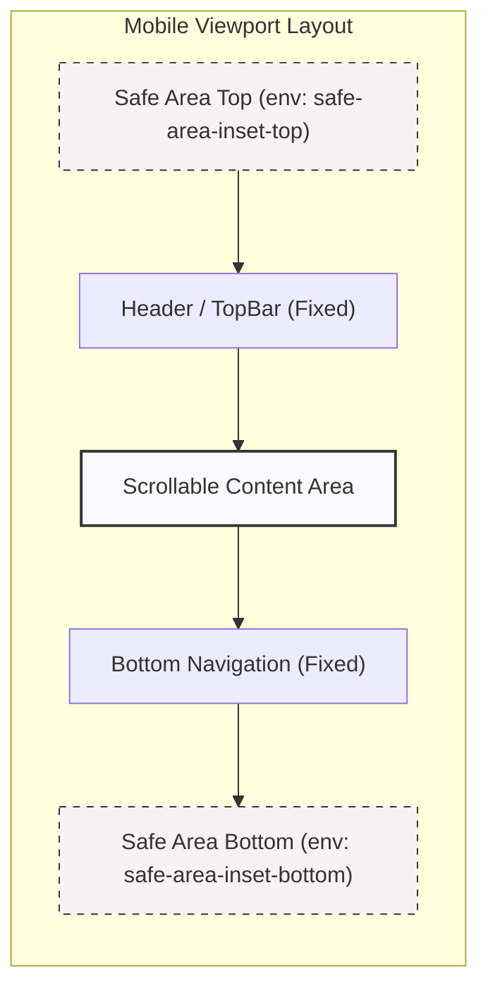
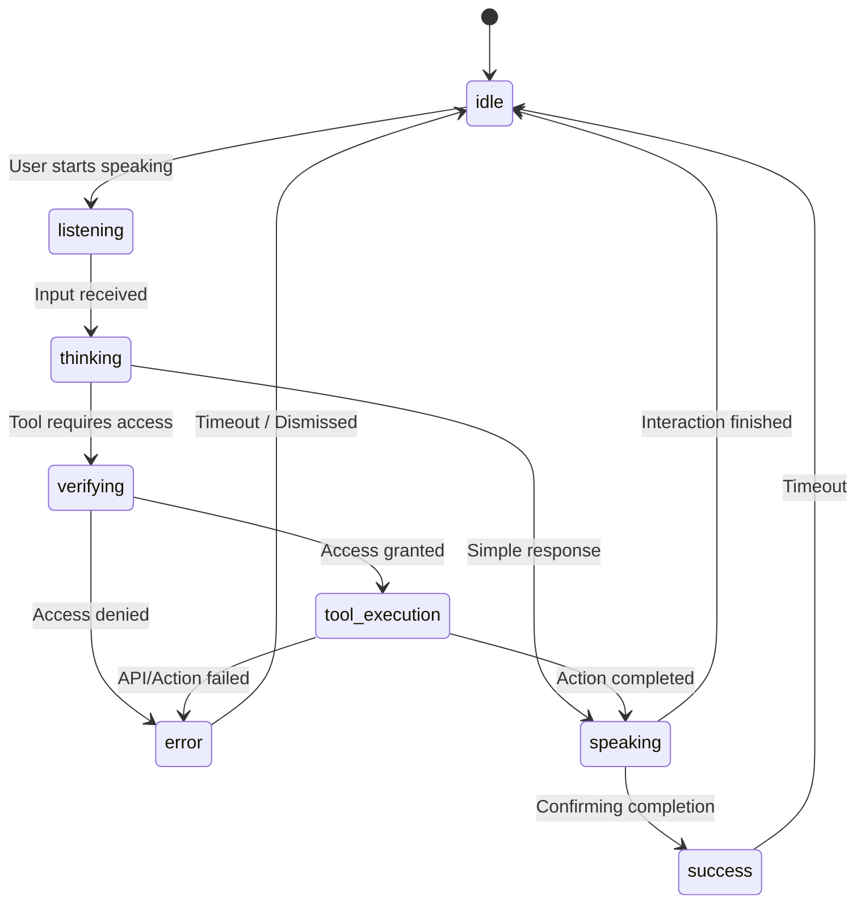
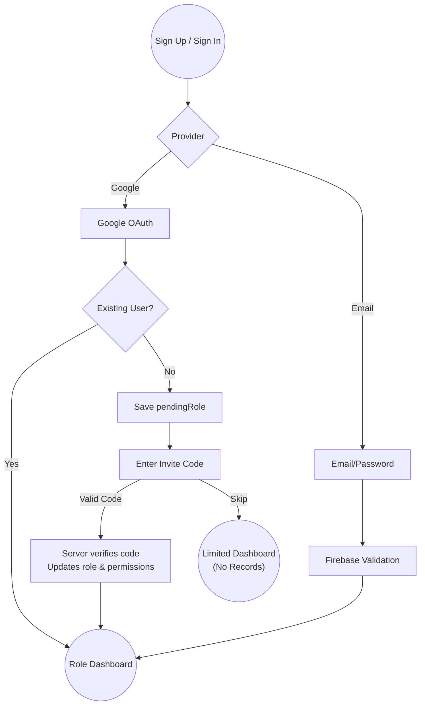

# EDVIA — Design System

EDVIA is a **mobile-first** product. The base styles are the phone styles;
breakpoints only add room. There is no desktop layout being shrunk down.

Target: **390 × 844**. Verified in-browser at 360, 390, 412, 768, 1024 and
1440 — see §8.

---

## 1. Foundations

`src/app/globals.css` holds the tokens. Three decisions carry most of the
mobile feel:



### Safe areas

`index.html` sets `viewport-fit=cover`, which lets content sit under the
notch and home indicator — so every fixed element has to add the inset back
itself:

```css
--safe-top:    env(safe-area-inset-top, 0px);
--safe-bottom: env(safe-area-inset-bottom, 0px);
--nav-total:   calc(var(--nav-height) + var(--safe-bottom));
```

`.app-shell` reserves `--nav-total` as bottom padding, and `BottomNav` pads
itself by `--safe-bottom`. Without both, the last card on every screen sits
under the home bar on an iPhone.

### Fluid type

`clamp()` ties size to viewport width, so a 360 px phone and a 430 px phone
are both proportionate without a breakpoint each:

| Token | Value | Used for |
|---|---|---|
| `--text-hero` | `clamp(2.25rem, 10vw, 3.25rem)` | Splash wordmark |
| `--text-display` | `clamp(1.75rem, 6.5vw, 2.25rem)` | Screen titles |
| `--text-title` | `clamp(1.25rem, 4.6vw, 1.5rem)` | Section headings |
| `--text-body` | `clamp(0.9375rem, 3.6vw, 1rem)` | Body — never below 15 px |
| `--screen-gutter` | `clamp(1rem, 4.2vw, 1.5rem)` | Horizontal padding |

### The 16px input floor

```css
input, select, textarea { font-size: max(16px, var(--text-body)); }
```

**Below 16 px, iOS Safari zooms the entire viewport when a field takes
focus.** It is the single most common mobile-form defect and it throws the
user out of the layout on every form.

A base-layer rule is not sufficient on its own: a Tailwind **utility** beats
`@layer base`, so `text-sm` on a component silently reintroduced the bug.
It was caught by measuring computed styles in a real browser, not by reading
the CSS. `Input`, the chat composer and the attendance date field all now
set `text-base` explicitly, dropping to `lg:text-[15px]` on desktop where
there is no zoom behaviour to defend against.

---

## 2. Navigation

| Viewport | Pattern |
|---|---|
| `< lg` | Fixed bottom bar, 5 destinations, elevated centre AI action |
| `≥ lg` | Left sidebar, wider destination list, content offset `248px` |

Both read from `src/config/nav.ts`, so a destination cannot exist in one and
be missing from the other.

**Five items** is the practical ceiling for a thumb-reachable bar. The AI
assistant takes the **centre** slot in every role — the easiest target on a
phone, for the product's centrepiece — and renders as a raised gradient pill
rather than a flat icon.

| Role | Items |
|---|---|
| Student | Home · Attendance · **AI** · Notices · Profile |
| Parent | Home · Attendance · **AI** · Notices · Profile |
| Teacher | Home · Classes · **AI** · Students · Profile |
| Principal | Home · Analytics · **AI** · Reports · Profile |

Active state is a dot under the icon rather than a filled pill — quieter,
and it survives long translated labels.

---

## 3. Colour and type

| Role | Value |
|---|---|
| Primary | `edvia-500` `#8257D3` → `edvia-700` `#57329B` |
| Background | `#FAF9FD` warm near-white |
| Surface | `#FFFFFF` |
| Success / Warning / Danger | `#22A06B` / `#F5A524` / `#E5484D` |

**Gradients are rationed.** They appear only on: the AI surface, the robot's
aura, the elevated nav action, primary buttons and the attendance ring. Flat
surfaces everywhere else are what make those read as special rather than
decorative.

Type is Inter (body) and Sora (display). `.stat-number` applies
`font-variant-numeric: tabular-nums` so attendance percentages don't jitter
as they animate or update.

---

## 4. The EDVIA robot

`src/components/shared/EdviaRobot.tsx`. Hand-built inline SVG — no image
asset, no animation library — so it scales, recolours per state and stays
crisp at any size.

### State is real

Every visual difference is driven by `state`, which comes from the
orchestrator's activity events: verifying access, executing a tool,
composing an answer. **Nothing runs on a timer pretending to be busy.**



| State | Expression | Aura | Orbit | Particles | Other |
|---|---|---|---|---|---|
| idle | neutral | soft | — | — | breathing, float, blink, glance |
| listening | attentive | pulse | — | — | leans forward, ears react, audio-reactive aura |
| thinking / verifying | focused | active | ✓ | ✓ | core pulses |
| tool_execution | focused | active | ✓ | ✓ | **its own accent** — the one state where the school's real records are being touched |
| speaking | happy | pulse | — | — | **mouth opens to real audio amplitude** |
| success | happy | pulse | — | — | one-shot bounce |
| error | concerned | none | — | — | gentle shake |

### Ambient motion is the exception

Idle breathing, floating, blinking and glancing are **not** simulating work
— they are the difference between a character and a picture of one. Two
details matter:

* **Blinks are irregular** (2.4–6.2 s). A perfectly periodic blink is the
  strongest "this is a loop" tell.
* **Breathing and float run at different periods** (4.2 s / 5.5 s) so they
  never sync into a single mechanical bob.

Blinking pauses while speaking — a talking face blinking on its own schedule
looks wrong.

### Performance

Transform and opacity only. No canvas, no layout thrash, no `requestAnimationFrame`
loop except a single `setTimeout` chain for blinks. "Particles" are six
absolutely-positioned spans on staggered delays, not a particle engine. This
is on screen constantly on a phone.

### Reduced motion

`globals.css` neutralises CSS animation — but **SVG SMIL `<animate>` ignores
`animation-duration` entirely**, so those elements kept running at full
speed. `useReducedMotion()` reads the preference in JS and the animating
elements are **not rendered**. The robot still changes colour, expression
and glow per state; it simply stops moving.

---

## 5. Attendance

`AttendanceRing` is the app's headline treatment: one large number, one
ring, one line of context — readable in under a second.

* SVG `stroke-dashoffset`, not `conic-gradient`: animates smoothly, works to
  one decimal, takes a rounded cap.
* Colour bands come from `bandFor()` in **`src/lib/attendanceMath.ts`**, next
  to the percentage formula, because the thresholds encode the seeded school
  **policy** (75% minimum for exam eligibility) rather than a design
  preference. The visual warning and the policy EDVIA can quote cannot drift.
* `noRecords` renders **"—"**, never `0%`. "No records" and "zero attendance"
  are different statements.
* The sweep animates from 0 on data that has **already loaded** — a
  presentation flourish, not a fake progress bar.
* Leave is labelled "half credit", the detail that otherwise makes the
  percentage look wrong to anyone recomputing it by hand.

---

## 6. School identity

`SchoolCrest` derives everything from the Firestore `schools/{id}` record:

* `logoUrl` when present, otherwise generated initials
* Initials **skip filler words** — "Greenfield International School" reads as
  **GI**, not **GS**
* Crest colour is a **deterministic hash of the name**, so a school keeps its
  colour across sessions and devices, and two schools look different with
  nothing configured

Rename the school in Firestore and the crest, initials and colour all follow.

`MobileHeader` pairs it with a time-aware greeting and one role-specific
context line, all from live data:

| Role | Subtitle |
|---|---|
| Student | "Ready for Class 10 - A today?" |
| Parent | "Rahul's school update" |
| Teacher | "3 classes today" |
| Principal | "School overview" |

Every branch has a fallback that reads as a complete sentence, so a
still-loading record never renders a line with a gap in it.

---

## 7. Authentication

Email and password, plus Google. Nothing else — every extra provider is
another failure mode to explain to a parent on a bus.



**Google sign-in does not weaken the role model.** `pendingRole` is what the
user tapped; it is written to the new profile and **grants nothing**. A staff
role still requires the server-written grant that only invite redemption
produces. An existing account ignores `pendingRole` entirely — the stored
profile wins. See [SECURITY.md §3.5](SECURITY.md).

The sign-up screen states this in the UI rather than letting someone discover
it afterwards: choosing Teacher or Principal shows a banner explaining that
school records stay locked until the invite code is entered.

Every Firebase error code maps to a sentence that says what to do next. A
**cancelled popup shows no error at all** — it is a decision, not a failure,
and flashing red for it trains people to distrust the error area.

There is no "success" visual on the Google button: success navigates.
Showing a tick before the profile has loaded would be the fake-success
pattern this product avoids everywhere else.

---

## 8. Verification

Measured in a real browser at every required width, by rendering each route
in a sized iframe (so `vw` units resolve correctly) and reading computed
styles:

| Route | 360 | 390 | 412 | 768 | 1024 | 1440 |
|---|:--:|:--:|:--:|:--:|:--:|:--:|
| `/auth/sign-in` | ✓ | ✓ | ✓ | ✓ | ✓ | ✓ |
| `/auth/sign-up` | ✓ | ✓ | ✓ | ✓ | ✓ | ✓ |
| `/role-selection` | ✓ | ✓ | ✓ | ✓ | ✓ | ✓ |

✓ = **no horizontal overflow** (`scrollWidth === clientWidth`) and every
input ≥ 16 px below `lg`.

Two defects were found this way and fixed:

1. Inputs computed to **14 px** — the base rule was being overridden by
   Tailwind's utility layer, so iOS would have zoomed on every form.
2. A standalone "Forgot password?" link was a **28 px** target; standalone
   links now meet 44 px. Inline links inside a sentence are exempt under
   WCAG 2.5.8 and were left alone.

`tests/ui.test.ts` covers the pure helpers behind the header and crest —
fallbacks, pluralisation, filler-word stripping, deterministic colour.

### Second measured pass (after the grades and support work)

Re-measured the same way, at 360 / 390 / 412 / 768 / 1024 / 1440, plus the
tightest rows of the three newest screens rendered against the real compiled
CSS with deliberately pathological content — a 44-character student name, a
long exam title, and a 79-character unbroken string in a support message.

| Check | Result |
|---|---|
| Horizontal overflow, public routes × 6 widths | **none** (`scrollWidth === clientWidth`) |
| Inputs ≥ 16 px below `lg` | ✓ |
| Tap targets ≥ 44 px | ✓ (after the fix below) |
| Enter Marks row at 360 px | 310 / 310 — **no overflow**, name truncates |
| Grades exam row at 360 px | 310 / 310 — **no overflow** |
| Support Inbox card at 360 px | 310 / 310 — **no overflow**, unbroken string wraps |

**Two defects were found by measuring, and both are fixed.**

**1. The bottom action bar was painted over by the bottom navigation.**
`BottomNav` is `fixed bottom-0 z-40`. The Save bar on Mark Attendance was
`fixed inset-x-0 bottom-0` with **no z-index**, so on every phone it overlapped
the nav by exactly `--nav-height` (measured: 64 px) and lost the paint order.
The primary commit action of the teacher's most-used screen was sitting
underneath the navigation.

Fixed with a shared `.action-bar` utility that offsets by `--nav-total` and
carries `z-30`, so the two stack instead of colliding. Re-measured: the bar's
bottom edge is exactly the nav's top edge, overlap 0. `.has-action-bar`
reserves the matching scroll padding. Enter Marks uses the same utility, so
the new screen could not reintroduce the bug.

**2. The TopBar back button was a 32 × 32 px target.** Below the 44 px
WCAG 2.5.5 minimum — and `TopBar` appears on nearly every screen, so this was
one defect repeated dozens of times. Both it and `NotificationBell` are now
44 × 44 with a compensating negative margin so the title keeps its optical
alignment. Re-measured at all six widths: 44 px everywhere.

The long-title case was fixed at the same time: the heading is `truncate`
inside a `min-w-0` flex child, so a long screen title shortens rather than
pushing a right-hand action off the screen.

---

### The authenticated shell

Also rendered and inspected. Because it needs a signed-in Firebase session,
it was viewed through a **throwaway** Vite config that aliased the two React
contexts to mock shims — no source was changed, and the harness was deleted
afterwards. Confirmed by eye at 390 × 844:

* `MobileHeader` per role — crest, time-aware greeting, and the correct
  role-specific context line ("Rahul's school update", "3 classes today",
  "Ready for Class 10 - A today?", "School overview")
* `BottomNav` for all four roles, with the elevated centre AI action and the
  right five destinations each
* `AttendanceRing` across all four bands plus the no-records state
* All eight robot states rendering distinctly (green success, red error,
  faded disconnected, orbital particles while thinking)
* `SchoolCrest` initials — **GI, RP, SX, DM** — each a different colour

**One defect was found by looking and fixed:** at small sizes the ring's
caption ("Below the 75% requirement") wrapped to two lines and spilled
outside the circle. Captions are now suppressed below 120 px, the number
scale was reduced, and the stroke scales with the ring. Re-verified by
measuring child bounding boxes against the ring's own box — zero breaches.

A second suspected defect — arcs looking far too short for their values —
turned out to be a misread of a downscaled screenshot. Measuring
`stroke-dashoffset` against `stroke-dasharray` gave exactly 96.4 / 84.1 /
77.3 / 66.7, and zooming in confirmed correct rendering. No change was made.

### Voice mode — verified in a live session

Voice mode has since been **exercised end-to-end in a real browser**:
microphone capture, streaming to Gemini Live, spoken response playback,
barge-in interrupting a reply mid-sentence, and the avatar following the real
session state — `listening` while the user speaks, `tool_execution` while a
school record is being read, `speaking` with the mouth opening to actual
output amplitude. See the Verification Log in
[CHALLENGE_COMPLIANCE.md](CHALLENGE_COMPLIANCE.md#verification-log).

That is what makes the "state is real" claim above testable rather than
merely asserted: the states a viewer sees are the states the session is
actually in.

**Still not seen rendered:** the document scanner, which needs live camera
permissions and a Gemini key; and the two screens added most recently
(Enter Marks, Support Inbox), whose data paths are covered by
`tests/grades.test.ts` and `tests/support.test.ts` against the real service
layer but which have not been opened in a browser session.
